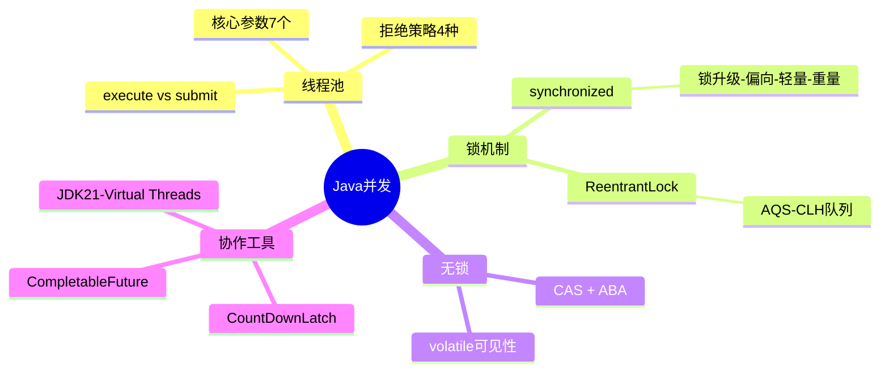

# 输出格式模板

## 文件头部：知识图谱

每个输出文件头部使用 Mermaid mindmap 展示本节知识拓扑，示例：



规则：
- 根节点用双括号 `(())` 表示本节主题
- 第一层为核心子领域，第二层为具体考点
- **最大深度 3 层**（root → 子领域 → 考点），不得更深
- **每个节点最多 6 个兄弟节点**，超出则合并或拆分为子图
- 节点名称简洁，≤10字
- **禁止使用特殊字符**：不使用全角括号（【】（））、冒号、引号、箭头符号（→←）。用短横线 `-` 替代连接符
- 跨域关联用文字标注（mindmap 不支持交叉引用）
- **渲染 fallback**：如果 topic 过于复杂导致 mindmap 节点超过 25 个，改用缩进列表替代：

```markdown
## 知识拓扑

- **Java并发**
  - 线程池：核心参数7个 / 拒绝策略4种 / execute vs submit
  - 锁机制：synchronized(锁升级) / ReentrantLock(AQS)
  - 无锁：CAS+ABA / volatile
  - 协作工具：CountDownLatch / CompletableFuture / Virtual Threads
```

---

## A级题（完整版）

生成时以下内容作为实际 Markdown 标题/列表/引用输出，不要包裹在代码块中。

A 级题分为 **核心区**（快速复习用）和 **深化区**（深度准备用），用水平线分隔。每文件 A 级题不超过 5 道（超出则拆分文件）。

---

### Q{编号}：[题目] ⭐⭐ | 🔥🔥🔥 | A级

**考察能力**：[维度1] + [维度2]（一句话说明面试官的判断标准）

#### 核心区（快速复习）

🟢 **基础提问**：[面试官原始问题的自然表述]

**必答要点**（3-5条，格式：`[标签] 动宾短语`，每条≤2句话）
- [核心] ...
- [原理] ...
- [边界] ...

**示例回答**（⭐约3句 / ⭐⭐约4-5句 / ⭐⭐⭐约6-8句，可含伪代码）

**记忆锚点**
> [按题型选策略，见 memory-anchor-guide.md]

---

#### 深化区（追问准备）

🔴 **追问连环套**
- L1: 追问 → 应对（2-3句）
  - 💡 面试官此时在验证：[具体判断点]
  - L2: 追问 → 应对
    - 💡 面试官此时在验证：[具体判断点]
    - L3: 追问 → 应对
      - 💡 面试官此时在验证：[具体判断点]

**踩坑提醒**
- ❌ 错误说法 → ✅ 正确理解

**加分项**（1-2条：源码细节/生产经验/新特性）

**项目结合**（叙事要素，非句式模板）
> 场景：[什么时候/什么系统/什么问题]
> 排查：[用什么工具/排除了什么]
> 方案：[选了什么/为什么不用替代方案]
> 效果：[量化结果]
> ⚠️ 面试官会追问：团队多大？数据量级？上线后有没有新问题？

---

## B级题（标准版）

### Q{编号}：[题目] ⭐⭐ | 🔥🔥 | B级

**考察能力**：[维度1]（一句话说明）

🟢 **基础提问**：[面试官原始问题]

**必答要点**（3-4条）

**示例回答**（3-5句）

🔴 **追问连环套**（L1→L2，2层）
- L1: 追问 → 应对
  - 💡 面试官此时在验证：[判断点]
  - L2: 追问 → 应对

**踩坑提醒**（1条）

**记忆锚点**

---

## C级题（精简版）

### Q{编号}：[题目] ⭐ | 🔥 | C级

**考察能力**：[维度]

🟢 **基础提问**：[面试官原始问题]

**核心回答**（1-3句，直击结论）

**记忆锚点**

---

## 行为面试题（模块二专用格式）

> ⚙️ **条件加载**：仅简历模式（type=behavioral/mixed）时使用本节格式。

简历模式下，行为面试题使用以下独立格式（不使用 A/B/C 分级模板）。
追问维度、STAR-T 详细规则、离职原因应对等内容见 `behavioral-interview.md`，此处仅定义输出骨架。

### BQ{编号}：[经历标题] — [公司/时间段] | [实习/正式]

**考察能力**：[维度1] + [维度2]（面试官判断标准：...）

🟢 **基础提问**："请介绍一下你在 XX 的工作内容"

**回答框架**（STAR-T，控制1.5-2分钟）：
> **S** 场景：[一句话交代背景]
> **T** 任务：[你要解决的具体问题]
> **A** 行动：[你做了什么——强调"我"不是"我们"]
> **R** 结果：[量化产出]
> **T** 收获：[你学到了什么/下次会怎么做不同]

🔴 **追问连环套**（从 behavioral-interview.md 六维度框架中选取与本经历相关的 3-4 个维度展开）

| 追问方向 | 面试官问法 | 应对要点 | 考察什么 |
|----------|-----------|----------|---------|
| [维度] | [具体问法] | [要点] | [能力] |
| ... | ... | ... | ... |

**⚠️ 真实性验证信号**（1-2条，针对本经历最可能被追问的点）

---

## 项目综合题（模块三专用格式）

> ⚙️ **条件加载**：仅简历模式时使用本节格式。level=实习/校招时使用下方"精简版"。

简历模式下，项目综合题使用以下独立格式：

### PJ{编号}：[项目名称] — [你的角色]

**考察能力**：[方案设计] + [问题定位]（面试官判断标准：...）

🟢 **基础提问**："介绍一下你做的 XX 项目"

**项目概述回答**（30秒版本）：
> [一句话项目背景] + [你的角色/分工] + [核心技术] + [主要成果]

🔴 **追问连环套**（按维度展开）

**维度1：项目背景**
- 面试官问："这个项目解决什么问题？为什么要做？"
- 应对要点：业务痛点 → 技术挑战 → 期望效果
- 💡 考察：业务理解能力

**维度2：你的分工**
- 面试官问："你在项目中负责哪部分？团队怎么分工的？"
- 应对要点：明确边界，个人 vs 团队
- 💡 考察：真实性验证
- ⚠️ 追问陷阱："这个架构决策是你做的还是leader定的？"

**维度3：核心难点**
- 面试官问："最难的技术问题是什么？"
- 应对要点：问题描述 → 为什么难 → 尝试过的路径
- 💡 考察：技术深度

**维度4：技术方案**
- 面试官问："为什么选这个方案？考虑过其他的吗？"
- 应对要点：候选方案对比 → 选型理由 → trade-off
- 💡 考察：方案设计能力
- ⚠️ 追问陷阱："如果数据量翻10倍，这个方案还能用吗？"

**维度5：Bug/风险处理**
- 面试官问："项目上线后出过什么问题？"
- 应对要点：现象 → 定位过程 → 根因 → 修复 → 防御
- 💡 考察：问题定位 + 工程成熟度

**维度6：优化思路**
- 面试官问："如果让你优化，你会从哪入手？"
- 应对要点：瓶颈分析 → 优化方向 → 预期效果
- 💡 考察：持续改进意识

**维度7：项目复盘**
- 面试官问："回头看，这个项目做得好和不好的地方？"
- 应对要点：成功点（有数据支撑）+ 不足点（有改进思路）
- 💡 考察：反思能力
- ⚠️ 加分：主动提"如果重做，我会..."

**记忆锚点**
> [项目核心数据/技术选型关键词/复盘要点的压缩记忆]

---

## 项目综合题（实习生/应届生精简版）

当 level 为"实习"或"校招"，且项目来自实习/课程/个人学习时，使用以下精简格式（仅保留 4 个维度）：

### PJ{编号}：[项目名称] — [你的角色] | [实习项目/课程项目/个人项目]

**考察能力**：[学习能力] + [问题定位]（面试官判断标准：...）

🟢 **基础提问**："介绍一下你做的 XX 项目"

**项目概述回答**（20秒版本）：
> [一句话背景] + [你负责的部分] + [用了什么技术] + [学到了什么]

🔴 **追问连环套**（精简 4 维度）

**维度1：你做了什么**
- 面试官问："你具体负责哪部分？"
- 应对要点：用具体任务描述（不说"参与了"）
- 💡 考察：真实性

**维度2：遇到什么困难**
- 面试官问："做的过程中遇到什么难点？"
- 应对要点：选一个真实技术问题，讲清"卡在哪→怎么查→怎么解决"
- 💡 考察：解决问题能力 + 学习方式

**维度3：学到了什么**
- 面试官问："这个项目你最大的收获？"
- 应对要点：技能层 + 方法层（不说空泛的"学到很多"）
- 💡 考察：学习能力 + 自我认知

**维度4：如果重做**
- 面试官问："如果重新做一遍，你会改什么？"
- 应对要点：具体的改进点（架构/工具/流程），展示反思
- 💡 考察：反思深度
- ⚠️ 加分项：能说出"当时不知道XX，现在会用YY替代"

**记忆锚点**
> [项目关键词 + 困难点 + 收获的压缩记忆]

⚠️ **不追问的维度**（与社招版的区别）：不追问技术选型trade-off、不追问线上故障处理、不追问性能优化数据。面试官对实习生的期望是"能学、能做、有反思"，不是"有架构决策能力"。

---

## 回答结构规则（自适应）

| 题型 | 推荐结构 |
|------|----------|
| 概念题 | 结论 → 原理 → 边界 |
| 场景题 | 问题拆解 → 方案+理由 → 权衡 |
| 源码题 | 核心流程 → 关键逻辑 → 设计意图 |
| 对比题 | 一句话核心差异 → 多维对比 → 选型 |
| 排查题 | 现象确认 → 排查链路 → 工具 → 根因 |

⚠️ 如果你需要先交代背景才能让结论成立，就先说背景。别为了结构牺牲自然感。

---

## 自测模式（可选）

当用户在参数中指定 `selftest: true` 或口头要求"自测模式/flashcard模式"时，每道题的示例回答用 HTML `<details>` 折叠，便于主动召回练习：

```markdown
### Q1：HashMap 的底层结构是什么？ ⭐⭐ | 🔥🔥🔥 | A级

**考察能力**：[基础知识]（验证候选人是否理解 HashMap 的核心数据结构演进）

🟢 **基础提问**："HashMap 底层是怎么实现的？"

**必答要点**
- [核心] 数组 + 链表 + 红黑树（JDK8+）
- [原理] hash 扰动降低碰撞概率
- [边界] 链表长度≥8 且数组≥64 时转红黑树

<details>
<summary>💡 点击展开示例回答</summary>

HashMap 底层是数组，每个位置挂链表...（完整回答）

</details>

**记忆锚点**
> "16容量16扰动，8且64转树，0.75扩"

<details>
<summary>🔴 追问连环套</summary>

- L1: "为什么是8转树不是6？" → 泊松分布概率...
  - 💡 面试官此时在验证：是否读过源码注释
  - L2: "红黑树退化回链表的条件？" → 6个节点时退化...

</details>
```

非自测模式（默认）下，所有内容直接展示，不使用 `<details>` 标签。

---

## 99-anchor-cheatsheet.md 格式

所有文件完成后生成的锚点速查表，使用表格格式：

```markdown
# 记忆锚点速查表

> 使用方法：遮住"展开触发词"和"核心要点"列，只看锚点尝试口述，然后对照检查。
> 建议复习节奏：Day 1 全部过一遍 → Day 3 只看标记⭐的 → Day 7 再全部过一遍。

## {知识域名称}

| # | 题目（简称） | 锚点 | 展开触发词 | 核心要点（1句） |
|---|-------------|------|-----------|----------------|
| Q1 | HashMap底层 | 16容量16扰动，8且64转树，0.75扩 | 数组+链表、扰动函数、树化条件 | 数组存Node，hash决定位置，冲突先链表后红黑树 |
| Q2 | ConcurrentHashMap | 分段→CAS，size用baseCount+Cell | 锁粒度、计数方式、扩容 | JDK8用synchronized+CAS锁单个Node |
| ... | ... | ... | ... | ... |

## {下一个知识域}

| # | 题目（简称） | 锚点 | 展开触发词 | 核心要点（1句） |
|---|-------------|------|-----------|----------------|
| ... | ... | ... | ... | ... |
```

规则：
- 按知识域分组，组内按原文件题目顺序
- 仅包含 A 级和 B 级题（C 级已足够精简，不重复）
- "展开触发词"为 2-3 个关键中间概念，帮助从锚点重建完整回答
- 单文件输出时（窄 topic 仅生成 1 个文件），跳过 cheatsheet 生成（信息重复）
