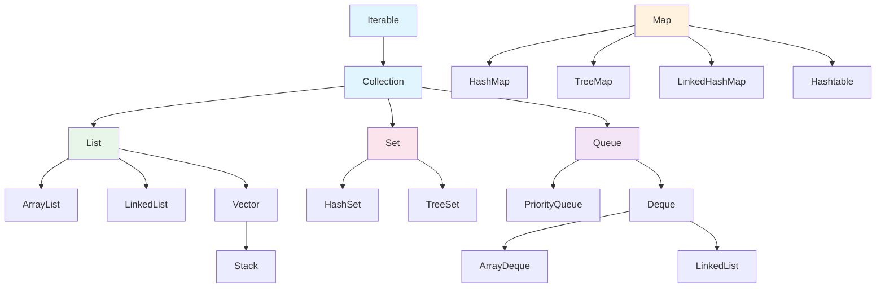

## 本文思维导图

```markmap
---
markmap:
  colorFreezeLevel: 2
  maxWidth: 300
---

# 初识集合框架

## 什么是集合框架
- java.util 包
- 接口 + 实现类
- 增删查操作
- 数据结构的官方封装

## 为什么要学
- 实际开发必备
- 面试高频考点
- 算法刷题基础

## Collection 单列集合
- List
  - ArrayList
  - LinkedList
- Set
  - HashSet
  - TreeSet
- Queue
  - PriorityQueue
  - Deque

## Map 键值对集合
- HashMap
- TreeMap
- LinkedHashMap

## 前置知识
- 泛型 Generic
- 自动装箱拆箱
- equals 与 hashCode
- Comparable 与 Comparator

## 容器选型
- 需要键值对 → Map
- 需要去重 → Set
- 需要有序访问 → List
- 需要排序 → TreeSet/TreeMap
```

## 学习目标

读完本文，你将能够：

1. 说出 Java 集合框架的两大体系（Collection 和 Map）及其核心区别
2. 列举常用容器及其底层数据结构和时间复杂度
3. 根据业务场景选出合适的容器
4. 了解深入学习集合框架所需的前置知识

> 本系列学习路径：集合框架全貌 → 复杂度分析 → ArrayList → LinkedList → HashMap → TreeMap → 并发容器。学完可以应对绝大多数集合相关面试题。

## 什么是集合框架

Java 集合框架（Java Collection Framework），也被称为容器（Container），是定义在 `java.util` 包下的一组接口（Interfaces）和实现类（Classes）。

它为程序员提供了一套标准化的方式来存储、检索和操纵一组数据元素，本质上就是对数据进行 **增、删、查** 操作。

用一句话概括：**集合框架 = 数据结构 + 算法的 Java 官方实现**。

你不需要自己手写链表、哈希表或红黑树，JDK 已经帮你封装好了经过工业级验证的实现——你需要做的是理解它们的特性，在合适的场景选择合适的容器。

## 为什么要学习集合框架

### 实际开发离不开它

日常 Java 开发中，几乎所有业务逻辑都涉及对数据的组织和管理。无论是从数据库查出的一批用户记录、前端传入的一组参数，还是内存中的缓存数据，全部要依赖集合框架来承载。

### 面试高频考点

集合框架是 Java 面试的重灾区，从初级到高级几乎每一轮都会涉及：

**初级 Java 工程师：**
- HashMap 中的 key 如何通过 `hashCode` 和 `equals` 确定存储位置？（提示：与取模运算和链表/红黑树有关）
- HashSet 底层是如何基于 HashMap 实现的？（提示：value 全部指向同一个 Object）
- HashMap 的扩容机制是怎样的？（提示：负载因子 0.75，容量翻倍）

**中级 Java 工程师：**
- ArrayList 和 LinkedList 的区别与使用场景？
- HashMap 的底层实现原理（数组 + 链表 + 红黑树）？
- HashMap 和 ConcurrentHashMap 有什么区别？

**高级 Java 工程师：**
- 如何设计一个高效的 LRU 缓存淘汰策略？
- Redis 的 zset 在 Java 中如何实现？
- `hashCode` 为什么选择 31 作为乘子？

### 刷题基础

LeetCode 上绝大多数题目的解法都需要借助集合容器——用 HashMap 做两数之和、用 Stack 做括号匹配、用 PriorityQueue 做 Top-K。没有集合框架的基础，算法题根本无从下手。

## 前置知识速览

> 以下概念在集合框架中频繁出现。如果你已经熟悉，可以跳过本节。

### 泛型（Generic）

集合框架大量使用泛型来保证类型安全：

```java
// 没有泛型（JDK 1.4 及之前）——需要强转，运行时可能 ClassCastException
ArrayList list = new ArrayList();
list.add("hello");
String s = (String) list.get(0);

// 有泛型（JDK 5+）——编译期检查，无需强转
ArrayList<String> list = new ArrayList<>();
list.add("hello");
String s = list.get(0); // 编译器保证这里一定是 String
```

### 自动装箱与拆箱（Autoboxing / Unboxing）

集合只能存储引用类型。Java 5 引入了自动装箱，让基本类型无缝放入集合：

```java
List<Integer> numbers = new ArrayList<>();
numbers.add(42);          // 自动装箱：int → Integer
int n = numbers.get(0);   // 自动拆箱：Integer → int
```

### equals 与 hashCode

集合判断元素"相等"的依据是 `equals` 方法，而不是 `==`。自定义类要放入 HashSet 或作为 HashMap 的 key，**必须同时重写 `equals` 和 `hashCode`**，否则会出现"明明内容相同却找不到"的诡异 bug。

### Comparable 与 Comparator

TreeSet、TreeMap 等有序集合需要知道元素的大小关系：

```java
// 方式一：元素实现 Comparable（自然排序）
TreeSet<String> set = new TreeSet<>(); // String 已实现 Comparable

// 方式二：传入 Comparator（定制排序）——推荐使用 Integer.compare 避免溢出
TreeSet<Student> set = new TreeSet<>(
    (a, b) -> Integer.compare(a.getAge(), b.getAge())
);
```

## 集合框架全貌

### 什么是数据结构

数据结构（Data Structure）是计算机中存储和组织数据的方式。它描述了数据元素之间的逻辑关系以及在内存中的物理存储形式。

同样是存储 100 个整数，用数组存和用链表存，虽然都能完成任务，但查找第 50 个元素的效率天差地别——这就是数据结构选择带来的差异。

### 继承体系总览

Java 集合框架由两棵独立的接口继承树组成：



> 注意：`Map` 不继承 `Collection`，它们是并列的两大体系。

### 生活化类比

在深入表格之前，先用几个类比建立直觉：

- **ArrayList** 像编了号的书架——找第 50 本书直接去 50 号位（快），但中间插入一本需要后面全部往后挪（慢）。
- **LinkedList** 像火车车厢——每节车厢只知道前后邻居，想找中间的得从头数（慢），但摘掉/加入一节车厢很快。
- **HashMap** 像拼音检字表——知道首字母就能快速翻到对应页，不需要从第一页找起。
- **TreeSet** 像已经按价格排好序的商品货架——新商品来了自动插到正确位置。
- **Stack** 像一摞盘子——只能从顶部拿和放（后进先出）。
- **Queue** 像排队买奶茶——先来的先买（先进先出）。

### 各容器对应的数据结构

| 容器 | 底层数据结构 | 时间复杂度（核心操作） | 线程安全 | null 支持 |
|------|-------------|---------------------|---------|----------|
| **ArrayList** | 动态数组 | 随机访问 O(1)，尾部插入均摊 O(1)，中间插入/删除 O(n) | 否 | 允许 |
| **LinkedList** | 双向链表 | 头尾插入/删除 O(1)，随机访问 O(n) | 否 | 允许 |
| **ArrayDeque** | 循环数组 | 头尾操作均摊 O(1) | 否 | 不允许 |
| **PriorityQueue** | 堆（完全二叉树） | 插入/删除 O(log n)，取最值 O(1) | 否 | 不允许 |
| **HashSet** | 哈希表（底层是 HashMap） | 增删查 O(1) | 否 | 允许 1 个 null |
| **TreeSet** | 红黑树 | 增删查 O(log n) | 否 | 不允许 null |
| **HashMap** | 数组 + 链表 + 红黑树（JDK 8+） | 增删查 O(1)，最坏 O(log n) | 否 | key/value 均允许 null |
| **TreeMap** | 红黑树 | 增删查 O(log n) | 否 | 不允许 null key |

> 线程安全的替代方案：`ConcurrentHashMap`、`CopyOnWriteArrayList`、`Collections.synchronizedList()` 等。Vector 和 Hashtable 虽然线程安全但性能差，已不推荐使用。

### Collection 与 Map 的区别

- **Collection** 存储的是单个元素，关注"这个元素在不在集合里"。
- **Map** 存储的是键值对（Key-Value），关注"通过 Key 能不能找到对应的 Value"。

```java
// Collection：存储一组用户名
List<String> names = new ArrayList<>();
names.add("Alice");
names.add("Bob");

// Map：存储用户名到年龄的映射
Map<String, Integer> ageMap = new HashMap<>();
ageMap.put("Alice", 25);
ageMap.put("Bob", 30);
```

### 常用操作速览

```java
// === List 基本操作 ===
List<String> list = new ArrayList<>();
list.add("Java");           // 添加元素
list.add(0, "Hello");       // 指定位置插入
list.get(0);                // 按索引获取 → "Hello"
list.set(1, "Python");      // 修改元素
list.remove(0);             // 按索引删除
list.contains("Python");    // 判断是否包含 → true
list.size();                // 获取大小

// === Set 基本操作 ===
Set<String> set = new HashSet<>();
set.add("Apple");           // 添加
set.add("Apple");           // 重复添加无效，set 仍然只有 1 个 Apple
set.contains("Apple");      // 判断是否存在 → true
set.remove("Apple");        // 删除

// === Map 基本操作 ===
Map<String, Integer> map = new HashMap<>();
map.put("age", 25);         // 添加键值对
map.get("age");             // 根据 key 获取 value → 25
map.containsKey("age");     // 判断 key 是否存在 → true
map.remove("age");          // 删除键值对
map.keySet();               // 获取所有 key 的 Set
map.values();               // 获取所有 value 的 Collection

// === 遍历方式 ===
// 增强 for 循环
for (String item : list) {
    System.out.println(item);
}
// Iterator 迭代器
Iterator<String> it = set.iterator();
while (it.hasNext()) {
    System.out.println(it.next());
}
// Map 遍历
for (Map.Entry<String, Integer> entry : map.entrySet()) {
    System.out.println(entry.getKey() + " = " + entry.getValue());
}
```

## 容器选型指南

遇到数据存储需求时，按以下思路决策：

```
需要键值对映射吗？
├── 是 → 需要按 key 排序吗？
│         ├── 是 → TreeMap
│         └── 否 → HashMap（最常用）
└── 否 → 需要去重吗？
          ├── 是 → 需要排序吗？
          │         ├── 是 → TreeSet
          │         └── 否 → HashSet
          └── 否 → 需要什么访问模式？
                    ├── 按索引随机访问 → ArrayList（最常用）
                    ├── 频繁头尾增删 → ArrayDeque
                    ├── 按优先级出队 → PriorityQueue
                    └── 频繁中间插删（已有节点引用） → LinkedList
```

**实际开发经验**：80% 的场景用 ArrayList + HashMap 就够了。先用最简单的，性能不够时再根据瓶颈换。

## 小结

- 集合框架是 JDK 对常见数据结构的官方封装，分为 Collection（单列）和 Map（键值对）两大体系。
- 每个容器背后都有对应的数据结构，决定了它的性能特征和适用场景。
- 选容器的核心思路：先确定是否需要键值对，再确定是否需要去重/排序，最后看访问模式。
- 学习集合框架需要泛型、装箱拆箱、equals/hashCode、Comparable 等前置知识。

**配套练习（LeetCode）：**
- HashMap：[#1 两数之和](https://leetcode.cn/problems/two-sum/)、[#49 字母异位词分组](https://leetcode.cn/problems/group-anagrams/)
- Stack/Deque：[#20 有效的括号](https://leetcode.cn/problems/valid-parentheses/)、[#155 最小栈](https://leetcode.cn/problems/min-stack/)
- PriorityQueue：[#215 数组中第K大的元素](https://leetcode.cn/problems/kth-largest-element-in-an-array/)

下一篇我们将进入**时间复杂度与空间复杂度**的分析，为后续源码学习打好理论基础。
