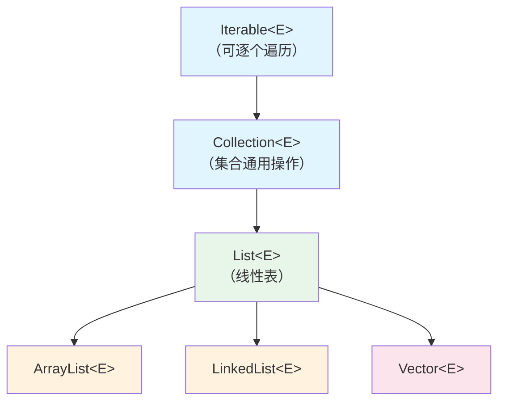

## 本文思维导图

```markmap
---
markmap:
  colorFreezeLevel: 2
  maxWidth: 300
---

# List 的介绍

## 继承体系
- Iterable（可迭代）
  - Collection（集合）
    - List（线性表）
      - ArrayList
      - LinkedList
      - Vector

## Collection 接口
- add / remove / contains
- size / isEmpty / clear
- iterator / toArray
- addAll / removeAll / retainAll

## List 接口特有方法
- 按下标操作
  - get(index)
  - set(index, element)
  - add(index, element)
  - remove(index)
- 查找
  - indexOf(Object)
  - lastIndexOf(Object)
- 截取
  - subList(from, to)

## 线性表的本质
- n 个相同类型元素的有限序列
- 支持增删改查
- 有序（保持插入顺序）
- 允许重复元素

## 使用方式
- List 是接口，不能直接实例化
- 通过实现类使用
  - ArrayList（动态数组）
  - LinkedList（双向链表）
```

## 学习目标

读完本文，你将能够：

1. 说出 List 在集合框架中的继承关系（Iterable → Collection → List）
2. 列举 Collection 接口中定义的核心方法
3. 掌握 List 接口特有的按下标操作方法
4. 理解为什么 List 是接口而不是类，以及如何正确使用它

> 本系列学习路径：集合框架全貌 → 复杂度分析 → 泛型 → **List 接口**（本文）→ ArrayList → LinkedList → HashMap → TreeMap → 并发容器。从本篇开始，我们正式进入具体容器的学习。

## 什么是 List

### 从继承体系说起

在 Java 集合框架中，`List` 是一个**接口**（Interface），它的继承链如下：



三层接口各自的职责：

- **Iterable**：表示"可迭代"，实现它的类可以用增强 for 循环遍历
- **Collection**：定义了集合的通用操作（增、删、查、判空、转数组等）
- **List**：在 Collection 基础上增加了**按下标操作**的能力

### 从数据结构角度理解 List

站在数据结构的角度看，List 就是一个**线性表**——n 个具有相同类型元素的有限序列，在该序列上可以执行增删改查以及遍历等操作。

List 的两个关键特征：

1. **有序**（Ordered）：元素按照插入顺序排列，第一个插入的在第 0 位，第二个在第 1 位，以此类推
2. **允许重复**：同一个元素可以出现多次（这是它与 Set 最大的区别）

## Collection 接口方法

Collection 接口定义了所有集合共有的基本操作。无论你用的是 List、Set 还是 Queue，这些方法都可以使用：

| 方法 | 说明 |
|------|------|
| `boolean add(E e)` | 添加元素 |
| `boolean remove(Object o)` | 删除指定元素（第一个匹配的） |
| `boolean contains(Object o)` | 判断是否包含指定元素 |
| `int size()` | 返回元素个数 |
| `boolean isEmpty()` | 判断是否为空 |
| `void clear()` | 清空所有元素 |
| `Iterator<E> iterator()` | 返回迭代器 |
| `Object[] toArray()` | 转换为数组 |
| `boolean addAll(Collection<? extends E> c)` | 添加另一个集合的所有元素 |
| `boolean removeAll(Collection<?> c)` | 删除所有在 c 中出现的元素 |
| `boolean retainAll(Collection<?> c)` | 只保留在 c 中出现的元素（求交集） |
| `boolean containsAll(Collection<?> c)` | 判断是否包含 c 中所有元素 |

> **面试题**：Collection 中有哪些方法？能说出上面表格中的核心方法即可，不需要死记全部——重点是 `add`、`remove`、`contains`、`size`、`isEmpty`、`clear`、`iterator`。

## List 接口特有方法

List 在 Collection 的基础上增加了**下标相关**的操作——这正是线性表"可按位置访问"的体现：

| 方法 | 说明 |
|------|------|
| `E get(int index)` | 获取下标 index 位置的元素 |
| `E set(int index, E element)` | 将下标 index 位置的元素替换为 element，返回旧值 |
| `void add(int index, E element)` | 在 index 位置插入元素，原位置及之后的元素后移 |
| `E remove(int index)` | 删除 index 位置的元素，返回被删除的元素 |
| `int indexOf(Object o)` | 返回第一个 o 出现的下标，不存在返回 -1 |
| `int lastIndexOf(Object o)` | 返回最后一个 o 出现的下标，不存在返回 -1 |
| `List<E> subList(int fromIndex, int toIndex)` | 截取 [fromIndex, toIndex) 范围的子列表 |

### 注意 remove 的重载

List 中有两个 `remove` 方法：

```java
// 继承自 Collection：按对象删除（删除第一个匹配的元素）
boolean remove(Object o);

// List 特有：按下标删除（删除指定位置的元素）
E remove(int index);
```

当 List 存储的是 `Integer` 类型时，这两个方法容易混淆：

```java
List<Integer> list = new ArrayList<>();
list.add(1);
list.add(2);
list.add(3);

list.remove(1);           // 删除下标 1 的元素（即删除 2）
list.remove(Integer.valueOf(1)); // 删除值为 1 的元素
```

> 这是一个非常经典的面试坑点。记住：传 `int` 就是按下标删，传 `Integer` 对象就是按值删。

### subList 的陷阱

`subList` 返回的是原 List 的**视图**（View），不是独立的副本：

```java
List<Integer> list = new ArrayList<>(Arrays.asList(1, 2, 3, 4, 5));
List<Integer> sub = list.subList(1, 3); // [2, 3]

sub.set(0, 99);  // 修改子列表
System.out.println(list); // [1, 99, 3, 4, 5] ← 原列表也被改了！

list.add(6);     // 修改原列表结构
System.out.println(sub); // ❌ 抛出 ConcurrentModificationException！
```

**两条规则**：

1. 修改子列表会影响原列表（因为是同一块内存）
2. 修改原列表结构后再访问子列表会抛异常（结构性修改破坏了视图的有效性）

如果需要独立副本，用 `new ArrayList<>(list.subList(1, 3))`。

## List 的使用

### 核心规则：面向接口编程

**List 是接口，不能直接实例化。** 使用时必须通过它的实现类：

```java
// ❌ 编译错误：不能实例化接口
List<String> list = new List<>();

// ✅ 使用 ArrayList 实现
List<String> list = new ArrayList<>();

// ✅ 使用 LinkedList 实现
List<String> list = new LinkedList<>();
```

为什么声明类型用 `List` 而不是 `ArrayList`？这是**面向接口编程**的原则——代码依赖抽象而非具体实现，后续切换实现类时只需改一处 `new`。

### 完整使用示例

```java
import java.util.ArrayList;
import java.util.List;

public class ListDemo {
    public static void main(String[] args) {
        // 创建 List
        List<String> list = new ArrayList<>();

        // 尾部添加
        list.add("Java");
        list.add("Python");
        list.add("Go");
        System.out.println(list); // [Java, Python, Go]

        // 指定位置插入
        list.add(1, "C++");
        System.out.println(list); // [Java, C++, Python, Go]

        // 获取元素
        String lang = list.get(0);
        System.out.println(lang); // Java

        // 修改元素
        list.set(2, "Rust");
        System.out.println(list); // [Java, C++, Rust, Go]

        // 删除元素（按下标）
        list.remove(1);
        System.out.println(list); // [Java, Rust, Go]

        // 查找元素
        int idx = list.indexOf("Rust");
        System.out.println("Rust 在下标: " + idx); // 1

        // 判断包含
        System.out.println(list.contains("Go")); // true

        // 获取大小
        System.out.println("元素个数: " + list.size()); // 3

        // 截取子列表
        List<String> sub = list.subList(0, 2);
        System.out.println(sub); // [Java, Rust]

        // 遍历方式 1：增强 for 循环
        for (String s : list) {
            System.out.print(s + " ");
        }
        System.out.println();

        // 遍历方式 2：普通 for 循环（利用下标）
        for (int i = 0; i < list.size(); i++) {
            System.out.print(list.get(i) + " ");
        }
        System.out.println();

        // 遍历方式 3：迭代器
        var it = list.iterator();
        while (it.hasNext()) {
            System.out.print(it.next() + " ");
        }
        System.out.println();

        // 清空
        list.clear();
        System.out.println(list.isEmpty()); // true
    }
}
```

### ArrayList vs LinkedList：如何选择

List 接口的两大实现类在性能上有本质区别：

| 操作 | ArrayList | LinkedList |
|------|-----------|------------|
| 按下标随机访问 `get(i)` | O(1) ✅ | O(n) ❌ |
| 尾部插入 `add(e)` | 均摊 O(1) ✅ | O(1) ✅ |
| 中间插入 `add(i, e)` | O(n)（需要移动元素） | O(n)（需要先定位） |
| 中间删除 `remove(i)` | O(n)（需要移动元素） | O(n)（需要先定位） |
| 内存占用 | 紧凑（连续数组） | 较大（每个节点额外存两个指针） |

**实际开发建议**：

- **绝大多数场景用 ArrayList**——现代 CPU 缓存对连续内存极为友好，ArrayList 的实际性能几乎总是优于 LinkedList
- **只有在需要频繁头部插入/删除时才考虑 LinkedList**，或者需要 Deque（双端队列）功能时
- 如果拿不准，默认 ArrayList，遇到性能问题再分析

## 小结

| 概念 | 核心要点 |
|------|---------|
| List | 有序、可重复、支持按下标操作的线性表接口 |
| Collection | 所有集合的父接口，定义增删查等通用操作 |
| Iterable | 最顶层接口，实现后可用增强 for 遍历 |
| 面向接口编程 | 声明用 `List<E>`，实例化用 `new ArrayList<>()` |
| subList | 返回视图而非副本，修改会相互影响 |
| remove 重载 | `remove(int)` 按下标，`remove(Object)` 按值 |

**关键认知**：

- List 是**接口**，定义了"线性表该有哪些操作"——它是一份**契约**
- ArrayList 和 LinkedList 是**实现类**，各自用不同的数据结构来履行这份契约
- 理解接口和实现的分离，是理解整个集合框架设计哲学的基础

**配套练习**：

- 创建一个 `List<Integer>`，依次插入 1~10，然后删除所有偶数，打印结果（注意 remove 的坑）
- 使用 `subList` 获取列表的前半部分，验证修改子列表是否影响原列表
- 对比三种遍历方式（增强 for、普通 for、迭代器）在遍历过程中删除元素的行为差异

下一篇我们将深入 **ArrayList** 的源码，看看动态数组是如何实现扩容、缩容和快速随机访问的。
