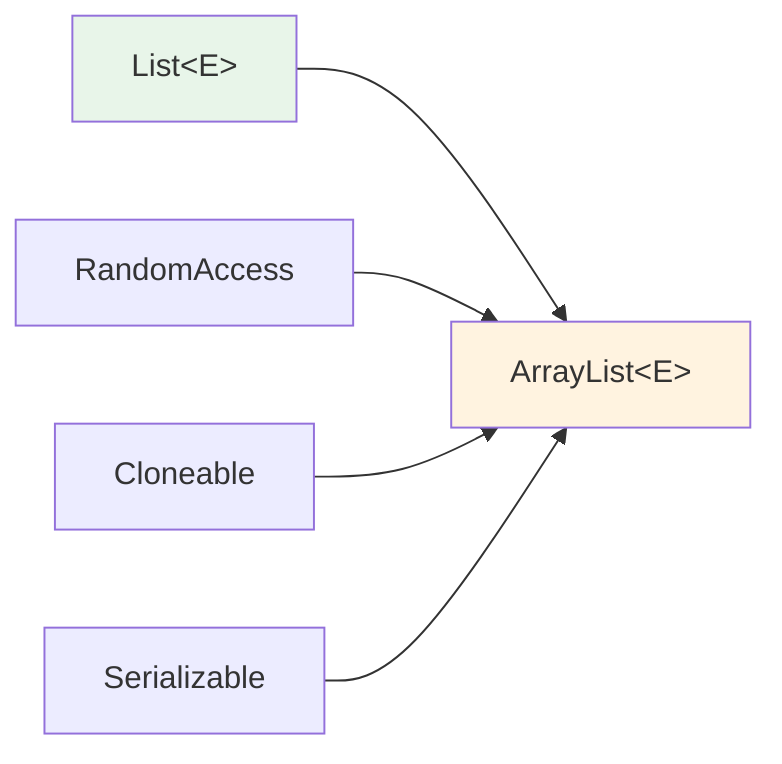
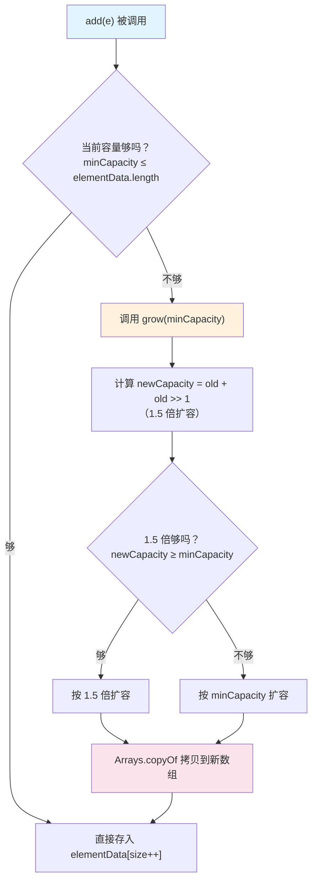

## 本文思维导图

```markmap
---
markmap:
  colorFreezeLevel: 2
  maxWidth: 300
---

# ArrayList 与顺序表

## 线性表
- 逻辑上连续（直线）
- 物理上不一定连续
- 常见形式
  - 顺序表（数组）
  - 链表
  - 栈
  - 队列

## 顺序表
- 物理地址连续
- 数组存储
- 手写实现
  - add / get / set / remove
  - contains / indexOf / size
  - display / clear

## ArrayList 简介
- 实现 List 接口
- 实现 RandomAccess（随机访问）
- 实现 Cloneable（可克隆）
- 实现 Serializable（可序列化）
- 非线程安全
- 动态扩容

## 构造方法
- 无参构造（初始容量 0）
- 指定初始容量
- 从 Collection 构造

## 扩容机制
- 首次添加扩容到 10
- 后续按 1.5 倍扩容
- oldCapacity + (oldCapacity >> 1)
- 超过 1.5 倍按需扩容
- 最大容量 Integer.MAX_VALUE - 8
- Arrays.copyOf 拷贝

## ArrayList 的局限
- 中间插入/删除 O(n)
- 扩容有性能开销
- 可能浪费空间
- 解决方案 → LinkedList
```

## 学习目标

读完本文，你将能够：

1. 手写一个简易顺序表，理解动态数组的底层原理
2. 掌握 ArrayList 的三种构造方式和常用操作
3. 读懂 ArrayList 源码中的扩容逻辑（grow 方法）
4. 理解 ArrayList 的性能边界和适用场景
5. 使用 ArrayList 实现一个简单的洗牌算法

> 本系列学习路径：集合框架全貌 → 复杂度分析 → 泛型 → List 接口 → **ArrayList**（本文）→ LinkedList → HashMap → TreeMap → 并发容器。本篇是第一个"源码级"的容器分析，理解了 ArrayList，后面的容器学习就有了方法论。

## 线性表

**线性表**（Linear List）是 n 个具有相同特性的数据元素的有限序列。线性表在实际中非常广泛，常见的线性表有：顺序表、链表、栈、队列等。

线性表在逻辑上是线性结构——连续的一条直线。但在物理结构上并不一定连续：

- **顺序存储**（数组）：物理上连续，支持随机访问
- **链式存储**（链表）：物理上不连续，通过指针连接

本篇我们聚焦**顺序存储**的实现——顺序表，以及 JDK 对它的工业级封装 `ArrayList`。

## 手写顺序表

顺序表是用一段**物理地址连续**的存储单元依次存储数据元素的线性结构，一般采用数组存储，在数组上完成数据的增删查改。

下图展示了顺序表的内存布局——前 6 格存储了有效数据，后 4 格为预留空间：


在学习 ArrayList 源码之前，我们先手写一个简易顺序表，理解其核心原理：

```java
public class SeqList {
    private int[] array;
    private int size; // 有效元素个数

    // 默认构造：初始容量 10
    public SeqList() {
        this(10);
    }

    // 指定初始容量
    public SeqList(int initCapacity) {
        this.array = new int[initCapacity];
        this.size = 0;
    }

    // 尾部添加元素
    public void add(int data) {
        ensureCapacity();
        array[size++] = data;
    }

    // 在 pos 位置插入元素
    public void add(int pos, int data) {
        if (pos < 0 || pos > size) {
            throw new IndexOutOfBoundsException("pos = " + pos);
        }
        ensureCapacity();
        // 从后往前搬移元素
        for (int i = size - 1; i >= pos; i--) {
            array[i + 1] = array[i];
        }
        array[pos] = data;
        size++;
    }

    // 判断是否包含某个元素
    public boolean contains(int toFind) {
        for (int i = 0; i < size; i++) {
            if (array[i] == toFind) return true;
        }
        return false;
    }

    // 查找元素对应的位置
    public int indexOf(int toFind) {
        for (int i = 0; i < size; i++) {
            if (array[i] == toFind) return i;
        }
        return -1;
    }

    // 获取 pos 位置的元素
    public int get(int pos) {
        if (pos < 0 || pos >= size) {
            throw new IndexOutOfBoundsException("pos = " + pos);
        }
        return array[pos];
    }

    // 设置 pos 位置的元素为 value
    public void set(int pos, int value) {
        if (pos < 0 || pos >= size) {
            throw new IndexOutOfBoundsException("pos = " + pos);
        }
        array[pos] = value;
    }

    // 删除第一次出现的元素
    public void remove(int toRemove) {
        int idx = indexOf(toRemove);
        if (idx == -1) return;
        // 从前往后搬移元素
        for (int i = idx; i < size - 1; i++) {
            array[i] = array[i + 1];
        }
        size--;
    }

    // 获取有效元素个数
    public int size() {
        return size;
    }

    // 清空顺序表
    public void clear() {
        size = 0;
    }

    // 扩容：容量不够时翻倍
    private void ensureCapacity() {
        if (size == array.length) {
            array = Arrays.copyOf(array, array.length * 2);
        }
    }

    // 打印（调试用）
    public void display() {
        System.out.print("[");
        for (int i = 0; i < size; i++) {
            System.out.print(array[i]);
            if (i < size - 1) System.out.print(", ");
        }
        System.out.println("]");
    }
}
```

**核心观察**：

- `add(pos, data)` 需要将 pos 及之后的元素全部后移——**O(n)**
- `remove` 需要将被删元素之后的元素全部前移——**O(n)**
- `get(pos)` 直接通过下标访问——**O(1)**
- 扩容时需要 `Arrays.copyOf` 整体拷贝——有开销

这就是顺序表的本质特征：**随机访问快，插入删除慢**。

## ArrayList 简介

在 JDK 集合框架中，`ArrayList` 就是顺序表的工业级实现。它是一个普通类，实现了 `List` 接口：



**关键特性**：

1. **泛型实现**：`ArrayList<E>` 可以存储任意引用类型
2. **RandomAccess 接口**：标记接口，表明支持 O(1) 随机访问
3. **Cloneable 接口**：支持 `clone()` 复制
4. **Serializable 接口**：支持序列化/反序列化
5. **非线程安全**：单线程使用。多线程场景用 `CopyOnWriteArrayList` 或 `Collections.synchronizedList()`
6. **动态扩容**：底层是连续空间，容量不够时自动扩容

> 注意：`Vector` 和 `ArrayList` 功能类似，但 `Vector` 是线程安全的（方法加了 `synchronized`），性能差，已不推荐使用。

## ArrayList 的构造

ArrayList 提供三种构造方式：

| 构造方法 | 说明 |
|---------|------|
| `ArrayList()` | 无参构造，初始底层数组为空（`{}`） |
| `ArrayList(int initialCapacity)` | 指定初始容量 |
| `ArrayList(Collection<? extends E> c)` | 用另一个集合的元素构造 |

```java
// 方式一：无参构造（最常用）
List<Integer> list1 = new ArrayList<>();

// 方式二：指定初始容量（预知数据量时推荐，避免频繁扩容）
List<Integer> list2 = new ArrayList<>(100);

// 方式三：从已有集合构造
list2.add(1);
list2.add(2);
list2.add(3);
ArrayList<Integer> list3 = new ArrayList<>(list2);

// ⚠️ 避免使用裸类型——会失去泛型类型检查
List list4 = new ArrayList(); // 不推荐！任何类型都能放入
list4.add("111");
list4.add(100); // 混入了不同类型，使用时是灾难
```

**重要细节**：无参构造时，底层数组并不会立即分配 10 个空间——它初始是一个空数组 `{}`，**第一次 `add` 时才扩容到 10**。这是 JDK 7+ 的懒初始化优化。

## ArrayList 常用操作

| 方法 | 说明 | 时间复杂度 |
|------|------|-----------|
| `boolean add(E e)` | 尾部添加 | 均摊 O(1) |
| `void add(int index, E element)` | 指定位置插入 | O(n) |
| `boolean addAll(Collection<? extends E> c)` | 尾部批量添加 | O(m) |
| `E get(int index)` | 按下标获取 | O(1) |
| `E set(int index, E element)` | 修改指定位置元素 | O(1) |
| `E remove(int index)` | 按下标删除 | O(n) |
| `boolean remove(Object o)` | 按值删除第一个匹配 | O(n) |
| `boolean contains(Object o)` | 判断是否包含 | O(n) |
| `int indexOf(Object o)` | 第一次出现的下标 | O(n) |
| `int lastIndexOf(Object o)` | 最后一次出现的下标 | O(n) |
| `List<E> subList(int from, int to)` | 截取子列表（视图） | O(1) |
| `void clear()` | 清空 | O(n) |
| `int size()` | 有效元素个数 | O(1) |

```java
List<String> list = new ArrayList<>();

list.add("JavaSE");
list.add("JavaWeb");
list.add("JavaEE");
list.add("JVM");
list.add("测试课程");
System.out.println(list); // [JavaSE, JavaWeb, JavaEE, JVM, 测试课程]

// 获取和设置
System.out.println(list.get(1));  // JavaWeb
list.set(1, "JavaWEB");
System.out.println(list.get(1));  // JavaWEB

// 指定位置插入（index 及后续元素后移）
list.add(1, "Java数据结构");
System.out.println(list); // [JavaSE, Java数据结构, JavaWEB, JavaEE, JVM, 测试课程]

// 按值删除
list.remove("JVM");
System.out.println(list); // [JavaSE, Java数据结构, JavaWEB, JavaEE, 测试课程]

// 按下标删除（注意不要越界）
list.remove(list.size() - 1);
System.out.println(list); // [JavaSE, Java数据结构, JavaWEB, JavaEE]

// 查找
list.add("JavaSE"); // 再加一个重复的
System.out.println(list.indexOf("JavaSE"));     // 0（从前往后找）
System.out.println(list.lastIndexOf("JavaSE")); // 4（从后往前找）

// 包含判断
if (list.contains("测试课程")) {
    list.add("测试课程");
}

// 子列表（注意：是视图，共用底层数组）
List<String> sub = list.subList(0, 4);
System.out.println(sub);

// 清空
list.clear();
System.out.println(list.size()); // 0
```

## ArrayList 的遍历

ArrayList 支持三种遍历方式：

```java
List<Integer> list = new ArrayList<>();
list.add(1);
list.add(2);
list.add(3);
list.add(4);
list.add(5);

// 方式一：for + 下标（ArrayList 最常用，随机访问 O(1)）
for (int i = 0; i < list.size(); i++) {
    System.out.print(list.get(i) + " ");
}
System.out.println();

// 方式二：for-each（简洁，推荐日常使用）
for (Integer num : list) {
    System.out.print(num + " ");
}
System.out.println();

// 方式三：迭代器（需要遍历中删除时使用 ListIterator）
Iterator<Integer> it = list.listIterator();
while (it.hasNext()) {
    System.out.print(it.next() + " ");
}
System.out.println();
```

> **建议**：ArrayList 日常遍历用 for-each 最简洁；需要下标时用 for + `get(i)`；需要遍历中安全删除时用 `ListIterator`。

## ArrayList 的扩容机制

这是面试高频考点。我们来逐步拆解 JDK 源码中的扩容流程。

### 源码关键字段

```java
// 存储元素的底层数组
Object[] elementData;

// 无参构造时的初始空数组
private static final Object[] DEFAULTCAPACITY_EMPTY_ELEMENTDATA = {};

// 默认容量
private static final int DEFAULT_CAPACITY = 10;

// 最大数组大小
private static final int MAX_ARRAY_SIZE = Integer.MAX_VALUE - 8;
```

### 扩容调用链

当你调用 `add(E e)` 时，内部执行流程如下：

```java
public boolean add(E e) {
    ensureCapacityInternal(size + 1); // 确保容量足够
    elementData[size++] = e;
    return true;
}

private void ensureCapacityInternal(int minCapacity) {
    ensureExplicitCapacity(calculateCapacity(elementData, minCapacity));
}

private static int calculateCapacity(Object[] elementData, int minCapacity) {
    // 如果是无参构造创建的空数组，第一次扩容到 DEFAULT_CAPACITY (10)
    if (elementData == DEFAULTCAPACITY_EMPTY_ELEMENTDATA) {
        return Math.max(DEFAULT_CAPACITY, minCapacity);
    }
    return minCapacity;
}

private void ensureExplicitCapacity(int minCapacity) {
    modCount++;
    // 只有当需要的最小容量超过当前数组长度时，才真正扩容
    if (minCapacity - elementData.length > 0)
        grow(minCapacity);
}
```

### grow 方法——真正的扩容逻辑

扩容的核心过程如下图所示——旧数组满后，分配一个 1.5 倍大小的新数组并复制元素：


```java
private void grow(int minCapacity) {
    int oldCapacity = elementData.length;

    // 核心：新容量 = 旧容量 + 旧容量/2 = 1.5 倍
    int newCapacity = oldCapacity + (oldCapacity >> 1);

    // 如果 1.5 倍仍不够（比如 addAll 一次加很多），按需扩容
    if (newCapacity - minCapacity < 0)
        newCapacity = minCapacity;

    // 如果超过最大数组大小，特殊处理
    if (newCapacity - MAX_ARRAY_SIZE > 0)
        newCapacity = hugeCapacity(minCapacity);

    // 使用 Arrays.copyOf 创建新数组并拷贝数据
    elementData = Arrays.copyOf(elementData, newCapacity);
}

private static int hugeCapacity(int minCapacity) {
    if (minCapacity < 0) // overflow
        throw new OutOfMemoryError();
    return (minCapacity > MAX_ARRAY_SIZE) ?
        Integer.MAX_VALUE : MAX_ARRAY_SIZE;
}
```

### 扩容流程总结



**关键结论**：

1. 无参构造的 ArrayList，底层数组初始为空（`{}`），**第一次 add 时扩容到 10**
2. 之后每次空间不足时，按 **1.5 倍**扩容（`oldCapacity + (oldCapacity >> 1)`）
3. 如果一次性需要的空间超过 1.5 倍（如 `addAll` 大集合），则按实际需要扩容
4. 扩容通过 `Arrays.copyOf` 实现——创建新数组 + 拷贝旧数据，有性能开销

> **面试题**：下面代码有什么问题？
> ```java
> List<Integer> list = new ArrayList<>();
> for (int i = 0; i < 100; i++) {
>     list.add(i);
> }
> ```
> **答**：功能没问题，但会触发多次扩容（0→10→15→22→33→49→73→109）。如果预知数据量为 100，用 `new ArrayList<>(100)` 指定初始容量可以避免 7 次扩容拷贝。

## 实战：扑克牌洗牌算法

用 ArrayList 实现一个完整的扑克牌程序——生成牌组、洗牌、发牌：

```java
import java.util.List;
import java.util.ArrayList;
import java.util.Random;

// 扑克牌类
public class Card {
    public int rank;    // 牌面值 1~13
    public String suit; // 花色

    @Override
    public String toString() {
        return String.format("[%s %d]", suit, rank);
    }
}

public class CardDemo {
    public static final String[] SUITS = {"♠", "♥", "♣", "♦"};

    // 生成一副 52 张牌
    private static List<Card> buyDeck() {
        List<Card> deck = new ArrayList<>(52); // 预知大小，指定容量
        for (int i = 0; i < 4; i++) {
            for (int j = 1; j <= 13; j++) {
                Card card = new Card();
                card.suit = SUITS[i];
                card.rank = j;
                deck.add(card);
            }
        }
        return deck;
    }

    // 交换两张牌
    private static void swap(List<Card> deck, int i, int j) {
        Card t = deck.get(i);
        deck.set(i, deck.get(j));
        deck.set(j, t);
    }

    // Fisher-Yates 洗牌算法：从后往前，每张牌随机和前面的某张交换
    private static void shuffle(List<Card> deck) {
        Random random = new Random();
        for (int i = deck.size() - 1; i > 0; i--) {
            int r = random.nextInt(i); // [0, i) 范围随机
            swap(deck, i, r);
        }
    }

    public static void main(String[] args) {
        // 买一副牌
        List<Card> deck = buyDeck();
        System.out.println("刚买回来的牌:");
        System.out.println(deck);

        // 洗牌
        shuffle(deck);
        System.out.println("洗过的牌:");
        System.out.println(deck);

        // 三个人，每人轮流抓 5 张牌
        List<List<Card>> hands = new ArrayList<>();
        hands.add(new ArrayList<>());
        hands.add(new ArrayList<>());
        hands.add(new ArrayList<>());

        for (int i = 0; i < 5; i++) {
            for (int j = 0; j < 3; j++) {
                hands.get(j).add(deck.remove(0)); // 从牌堆顶部抓牌
            }
        }

        System.out.println("剩余的牌: " + deck);
        System.out.println("A 手中的牌: " + hands.get(0));
        System.out.println("B 手中的牌: " + hands.get(1));
        System.out.println("C 手中的牌: " + hands.get(2));
    }
}
```

**代码要点**：

- `buyDeck()` 使用 `new ArrayList<>(52)` 预分配容量——已知牌数，避免扩容
- 洗牌使用 **Fisher-Yates 算法**（也叫 Knuth 洗牌），保证每种排列等概率
- 发牌使用 `deck.remove(0)`——注意这是 O(n) 操作（所有元素前移），如果追求性能可以用下标指针代替

## ArrayList 的局限与思考

ArrayList 底层是连续空间（数组），这带来了三个固有问题：

1. **中间插入/删除代价高**：需要移动后续所有元素，时间复杂度 O(n)
2. **扩容有开销**：需要申请新空间、拷贝数据、释放旧空间
3. **可能浪费空间**：1.5 倍扩容后如果不再添加元素，多余空间就浪费了。例如容量 100 满了扩到 150，之后只插入 5 个元素，就浪费了 45 个位置

**思考**：如何解决这些问题？

答案是**链表**（LinkedList）。链表不需要连续空间，插入删除只需改指针——O(1)，也不存在扩容问题。但链表的代价是：不支持随机访问（找第 k 个元素需要从头遍历），且每个节点额外存储指针，内存开销大。

这就是数据结构的 trade-off：**没有银弹，只有取舍**。

## 小结

| 概念 | 核心要点 |
|------|---------|
| 线性表 | 逻辑连续的有限序列，物理上可连续（数组）可不连续（链表） |
| 顺序表 | 物理地址连续，支持 O(1) 随机访问 |
| ArrayList | JDK 对顺序表的工业级泛型实现 |
| 扩容机制 | 懒初始化（空→10），后续 1.5 倍增长 |
| 性能特征 | 尾部操作 O(1)，中间操作 O(n)，随机访问 O(1) |
| 适用场景 | 读多写少、按下标访问频繁、数据量可预估 |

**最佳实践**：

- 预知数据量时，用 `new ArrayList<>(capacity)` 避免频繁扩容
- 80% 的场景 ArrayList 够用，遇到性能问题再分析瓶颈
- 不要在遍历中用 `list.remove()`——用 `Iterator.remove()` 或逆序删除

**配套练习**：

- [LeetCode #118 杨辉三角](https://leetcode.cn/problems/pascals-triangle/)——用 `List<List<Integer>>` 构建
- [LeetCode #26 删除有序数组中的重复项](https://leetcode.cn/problems/remove-duplicates-from-sorted-array/)
- 手写顺序表的泛型版本 `SeqList<E>`，要求支持扩容和缩容（size < capacity/4 时缩容）

下一篇我们将进入 **LinkedList** 的学习，看看链式存储如何解决 ArrayList 的插入删除瓶颈——以及它自身的代价。
