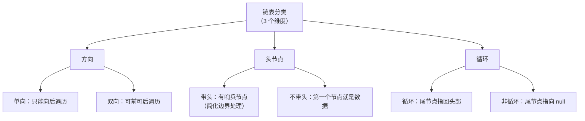
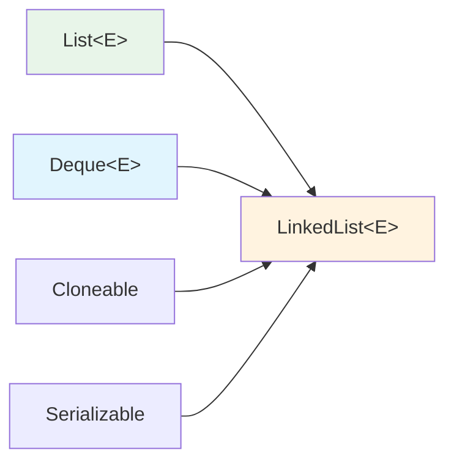

## 本文思维导图

```markmap
---
markmap:
  colorFreezeLevel: 2
  maxWidth: 300
---

# LinkedList 与链表

## ArrayList 的缺陷
- 中间插入/删除 O(n)
- 扩容有拷贝开销
- 不适合频繁插删场景

## 链表的概念
- 物理上非连续存储
- 通过引用链接节点
- 逻辑顺序 ≠ 物理顺序

## 链表分类（8种组合）
- 方向
  - 单向
  - 双向
- 头节点
  - 带头（哨兵）
  - 不带头
- 循环
  - 循环
  - 非循环

## 重点掌握
- 无头单向非循环链表
  - 其他数据结构的子结构
  - 笔试面试高频
- 无头双向链表
  - LinkedList 底层实现

## LinkedList 特性
- 实现 List 接口
- 实现 Deque 接口
- 双向链表结构
- 不支持 RandomAccess
- 任意位置插删 O(1)
- 随机访问 O(n)

## 经典面试题
- 反转链表
- 链表中间节点
- 倒数第 k 个节点
- 合并有序链表
- 判断链表有环
- 找环入口
```

## 学习目标

读完本文，你将能够：

1. 说出 ArrayList 的三大缺陷，理解为什么需要链表
2. 掌握链表的 8 种分类方式，知道哪两种最重要
3. 手写无头单向非循环链表的核心操作
4. 理解 LinkedList 的双向链表结构和接口实现
5. 在 ArrayList 和 LinkedList 之间做出正确选择

> 本系列学习路径：集合框架全貌 → 复杂度分析 → 泛型 → List 接口 → ArrayList → **LinkedList**（本文）→ HashMap → TreeMap → 并发容器。上一篇我们学了 ArrayList 的优势（O(1) 随机访问）和痛点（中间插删慢），本篇就来看链表如何解决这些痛点——以及它为此付出了什么代价。

## ArrayList 的缺陷

通过上一篇的源码分析，我们知道 ArrayList 底层是一段连续的 `Object[]` 数组。这带来三个固有问题：

**1. 中间插入/删除效率低——O(n)**

当在任意位置插入或删除元素时，需要将后续元素整体往后或往前搬移。如果有 10 万个元素，在头部插入一个就要搬移 10 万次。

**2. 扩容有性能开销**

空间不够时需要申请新数组、拷贝全部数据、释放旧空间。如果恰好在性能敏感路径上触发扩容，会导致延迟尖刺。

**3. 空间可能浪费**

1.5 倍扩容后，如果不再继续添加元素，多余空间就浪费了。

因此，Java 集合框架引入了 **LinkedList**——基于链表结构，从根本上解决插入删除的性能问题。

## 链表的概念与结构

### 什么是链表

链表是一种**物理存储结构上非连续**的存储结构。数据元素的逻辑顺序是通过链表中的**引用链接**次序实现的。

与数组的对比：

| | 数组（顺序表） | 链表 |
|--|------------|------|
| 物理存储 | 连续内存 | 分散内存 |
| 逻辑顺序 | 下标天然有序 | 通过引用（指针）连接 |
| 访问方式 | 下标直接定位 O(1) | 必须从头遍历 O(n) |
| 插入/删除 | 需搬移元素 O(n) | 修改引用即可 O(1) |
| 内存分配 | 一次性分配连续块 | 按需分配单个节点 |

### 链表的分类

链表结构由三个维度组合而成，共 **2 × 2 × 2 = 8 种**：



虽然有 8 种组合，但实际开发和面试中只需要**重点掌握两种**：

### 无头单向非循环链表

结构最简单：每个节点只有一个 `next` 引用指向下一个节点，最后一个节点的 `next` 为 `null`。

```
[data|next] → [data|next] → [data|next] → null
```

**使用场景**：
- 一般不会单独用来存储数据
- 作为**其他数据结构的子结构**（哈希桶、图的邻接表等）
- **笔试面试**中出现频率极高

### 无头双向链表

每个节点有两个引用：`prev` 指向前驱节点，`next` 指向后继节点。

```
null ← [prev|data|next] ⇄ [prev|data|next] ⇄ [prev|data|next] → null
```

**使用场景**：
- **JDK 中 `LinkedList` 的底层实现**就是无头双向链表
- 支持双向遍历，任意位置插删只需修改前后引用

## 手写单向链表

理解链表最好的方式是自己实现一个。以下是无头单向非循环链表的核心代码：

```java
public class SingleLinkedList {
    // 节点内部类
    private static class Node {
        int val;
        Node next;

        Node(int val) {
            this.val = val;
            this.next = null;
        }
    }

    private Node head; // 头节点引用

    // 头插法：O(1)
    public void addFirst(int val) {
        Node newNode = new Node(val);
        newNode.next = head;
        head = newNode;
    }

    // 尾插法：O(n)——需要遍历到最后
    public void addLast(int val) {
        Node newNode = new Node(val);
        if (head == null) {
            head = newNode;
            return;
        }
        Node cur = head;
        while (cur.next != null) {
            cur = cur.next;
        }
        cur.next = newNode;
    }

    // 在 index 位置插入
    public void addAtIndex(int index, int val) {
        if (index < 0) return;
        if (index == 0) {
            addFirst(val);
            return;
        }
        // 找到 index-1 位置的节点
        Node prev = head;
        for (int i = 0; i < index - 1 && prev != null; i++) {
            prev = prev.next;
        }
        if (prev == null) return; // index 越界
        Node newNode = new Node(val);
        newNode.next = prev.next;
        prev.next = newNode;
    }

    // 删除第一次出现的 val
    public void remove(int val) {
        if (head == null) return;
        // 特殊处理头节点
        if (head.val == val) {
            head = head.next;
            return;
        }
        Node prev = head;
        while (prev.next != null) {
            if (prev.next.val == val) {
                prev.next = prev.next.next;
                return;
            }
            prev = prev.next;
        }
    }

    // 查找是否包含 val
    public boolean contains(int val) {
        Node cur = head;
        while (cur != null) {
            if (cur.val == val) return true;
            cur = cur.next;
        }
        return false;
    }

    // 获取链表长度
    public int size() {
        int count = 0;
        Node cur = head;
        while (cur != null) {
            count++;
            cur = cur.next;
        }
        return count;
    }

    // 打印链表
    public void display() {
        Node cur = head;
        while (cur != null) {
            System.out.print(cur.val + " → ");
            cur = cur.next;
        }
        System.out.println("null");
    }
}
```

**核心观察**：

- 头插 `addFirst` 是 O(1)——只需改两个引用
- 尾插 `addLast` 是 O(n)——必须遍历到末尾（如果维护一个 `tail` 引用可以优化为 O(1)）
- 删除和查找都是 O(n)——必须遍历
- 不存在扩容问题——每个节点独立分配

## 链表经典面试题

链表是面试中最高频的数据结构题型之一。以下是必须掌握的经典题目：

### 反转链表

**思路**：遍历链表，逐个翻转 `next` 指针的方向。

```java
// LeetCode #206
public ListNode reverseList(ListNode head) {
    ListNode prev = null;
    ListNode cur = head;
    while (cur != null) {
        ListNode next = cur.next; // 保存下一个节点
        cur.next = prev;          // 翻转指向
        prev = cur;               // prev 前进
        cur = next;               // cur 前进
    }
    return prev;
}
```

### 链表的中间节点

**思路**：快慢指针。慢指针一次走一步，快指针一次走两步，当快指针到达末尾时，慢指针恰好在中间。

```java
// LeetCode #876
public ListNode middleNode(ListNode head) {
    ListNode slow = head, fast = head;
    while (fast != null && fast.next != null) {
        slow = slow.next;
        fast = fast.next.next;
    }
    return slow;
}
```

### 倒数第 k 个节点

**思路**：快指针先走 k 步，然后快慢指针同时走，快指针到末尾时慢指针就在倒数第 k 个。

```java
public ListNode getKthFromEnd(ListNode head, int k) {
    ListNode fast = head, slow = head;
    // fast 先走 k 步
    for (int i = 0; i < k; i++) {
        fast = fast.next;
    }
    // 同时走，直到 fast 到末尾
    while (fast != null) {
        fast = fast.next;
        slow = slow.next;
    }
    return slow;
}
```

### 判断链表是否有环

**思路**：快慢指针。如果有环，快指针一定会追上慢指针（就像在操场跑步，跑得快的人一定会套圈）。

```java
// LeetCode #141
public boolean hasCycle(ListNode head) {
    ListNode slow = head, fast = head;
    while (fast != null && fast.next != null) {
        slow = slow.next;
        fast = fast.next.next;
        if (slow == fast) return true; // 相遇说明有环
    }
    return false; // fast 到了末尾，无环
}
```

**为什么快指针走两步、慢指针走一步一定能相遇？** 当两个指针都进入环后，每移动一次，两者之间的距离缩小 1。距离从 n 开始每次减 1，一定会减到 0——即相遇。不存在"恰好跳过"的情况。

### 找环的入口

**思路**：先用快慢指针找到环内相遇点，然后让一个指针从 head 出发，另一个从相遇点出发，每次各走一步，再次相遇的点就是入环点。

```java
// LeetCode #142
public ListNode detectCycle(ListNode head) {
    ListNode slow = head, fast = head;
    while (fast != null && fast.next != null) {
        slow = slow.next;
        fast = fast.next.next;
        if (slow == fast) {
            // 找到相遇点，开始找入口
            ListNode p = head;
            while (p != slow) {
                p = p.next;
                slow = slow.next;
            }
            return p;
        }
    }
    return null;
}
```

### 合并两个有序链表

```java
// LeetCode #21
public ListNode mergeTwoLists(ListNode l1, ListNode l2) {
    ListNode dummy = new ListNode(0); // 哨兵节点简化边界
    ListNode cur = dummy;
    while (l1 != null && l2 != null) {
        if (l1.val <= l2.val) {
            cur.next = l1;
            l1 = l1.next;
        } else {
            cur.next = l2;
            l2 = l2.next;
        }
        cur = cur.next;
    }
    cur.next = (l1 != null) ? l1 : l2;
    return dummy.next;
}
```

## LinkedList 的使用

### LinkedList 简介

JDK 中的 `LinkedList` 底层是**无头双向链表**。它的节点结构如下：

```java
private static class Node<E> {
    E item;       // 数据
    Node<E> next; // 后继引用
    Node<E> prev; // 前驱引用

    Node(Node<E> prev, E element, Node<E> next) {
        this.item = element;
        this.next = next;
        this.prev = prev;
    }
}
```

LinkedList 实现了两个重要接口：



- **List**：支持所有列表操作（get、set、add、remove）
- **Deque**（双端队列）：支持头尾两端的高效操作（offerFirst、offerLast、pollFirst、pollLast）

**注意**：LinkedList **没有实现 `RandomAccess` 接口**——因为它不支持 O(1) 随机访问。

### 构造方法

| 构造方法 | 说明 |
|---------|------|
| `LinkedList()` | 无参构造，创建空链表 |
| `LinkedList(Collection<? extends E> c)` | 用其他集合的元素构造 |

```java
// 无参构造
List<Integer> list1 = new LinkedList<>();

// 从已有集合构造
List<Integer> list2 = new LinkedList<>(Arrays.asList(1, 2, 3));
```

### 常用方法

LinkedList 作为 List 使用时，方法和 ArrayList 完全一致（因为都实现了 List 接口）：

| 方法 | 说明 | 时间复杂度 |
|------|------|-----------|
| `boolean add(E e)` | 尾部添加 | O(1) |
| `void add(int index, E element)` | 指定位置插入 | O(n) 定位 + O(1) 插入 |
| `E get(int index)` | 按下标获取 | O(n) |
| `E set(int index, E element)` | 修改指定位置 | O(n) |
| `E remove(int index)` | 按下标删除 | O(n) 定位 + O(1) 删除 |
| `boolean contains(Object o)` | 判断是否包含 | O(n) |
| `int size()` | 获取大小 | O(1) |

作为 Deque（双端队列）使用时，额外方法：

| 方法 | 说明 | 时间复杂度 |
|------|------|-----------|
| `void addFirst(E e)` | 头部添加 | O(1) |
| `void addLast(E e)` | 尾部添加 | O(1) |
| `E getFirst()` | 获取头元素 | O(1) |
| `E getLast()` | 获取尾元素 | O(1) |
| `E removeFirst()` | 删除头元素 | O(1) |
| `E removeLast()` | 删除尾元素 | O(1) |

### 使用示例

```java
LinkedList<Integer> list = new LinkedList<>();

// 作为 List 使用
list.add(1);
list.add(2);
list.add(3);
list.add(1, 99); // 在下标 1 插入 99
System.out.println(list); // [1, 99, 2, 3]

// 作为 Deque（双端队列）使用
list.addFirst(0);
list.addLast(4);
System.out.println(list); // [0, 1, 99, 2, 3, 4]

System.out.println(list.getFirst()); // 0
System.out.println(list.getLast());  // 4

list.removeFirst();
list.removeLast();
System.out.println(list); // [1, 99, 2, 3]

// 遍历方式与 ArrayList 相同
for (int num : list) {
    System.out.print(num + " ");
}
System.out.println();
```

### LinkedList 的"O(1) 插删"是有前提的

经常听到说"LinkedList 任意位置插删是 O(1)"——这个说法**有误导性**。

准确地说：**在已知节点引用的情况下**，插入和删除是 O(1)。但如果你通过 `add(int index, E e)` 按下标插入，底层需要先**遍历找到 index 位置**（O(n)），然后才是 O(1) 的指针修改。

所以 `list.add(5000, "hello")` 对 LinkedList 并不比 ArrayList 快多少——两者都是 O(n)，只是 ArrayList 是搬移元素，LinkedList 是遍历找位置。

**真正体现 LinkedList 优势的场景**：

- 使用迭代器遍历时边遍历边删除——迭代器已经持有节点引用
- 频繁在头部/尾部操作——`addFirst`、`removeFirst` 等真正的 O(1)
- 实现队列或双端队列——`Deque` 接口的天然实现

## ArrayList vs LinkedList 选型

这是面试必考的对比题。以下是完整对比：

| 维度 | ArrayList | LinkedList |
|------|-----------|------------|
| 底层结构 | 动态数组 | 双向链表 |
| 存储空间 | 物理上连续 | 物理上不连续 |
| 随机访问 | O(1) ✅ | O(n) ❌ |
| 头部插入 | O(n)（搬移元素） | O(1) ✅ |
| 尾部插入 | 均摊 O(1) | O(1) |
| 中间插入 | O(n)（搬移） | O(n)（遍历）+ O(1)（修改引用） |
| 扩容 | 需要扩容拷贝 | 无扩容概念 |
| 内存效率 | 紧凑（可能浪费尾部空间） | 每个节点额外存 prev + next 引用 |
| 缓存友好 | ✅（连续内存，CPU 缓存命中高） | ❌（节点分散，缓存不友好） |
| 适用场景 | 频繁随机访问、尾部操作 | 频繁头尾插删、作为队列/双端队列 |

### 选型决策

```
需要按下标频繁读取元素吗？
├── 是 → ArrayList
└── 否 → 需要频繁在头部/尾部插入删除吗？
          ├── 是 → LinkedList（或 ArrayDeque）
          └── 否 → 默认选 ArrayList
```

> **实际开发建议**：绝大多数场景用 **ArrayList**。原因是现代 CPU 缓存对连续内存极为友好，ArrayList 的实际性能在大多数操作模式下都优于 LinkedList。只有在明确需要队列语义（FIFO）或频繁头部操作时，才考虑 LinkedList 或 `ArrayDeque`。

## 小结

| 概念 | 核心要点 |
|------|---------|
| 链表 | 物理非连续，通过引用链接，没有扩容问题 |
| 单向链表 | 面试高频，是哈希桶等结构的子结构 |
| 双向链表 | LinkedList 的底层实现，支持双向遍历 |
| LinkedList | 实现 List + Deque，头尾操作 O(1)，随机访问 O(n) |
| 选型原则 | 默认 ArrayList；需要队列语义或频繁头尾操作时用 LinkedList |

**关键认知**：

- "LinkedList 插删快"是个**有条件的结论**——只有在已持有节点引用时才是 O(1)
- ArrayList 凭借 CPU 缓存优势，在大多数实际场景中性能优于 LinkedList
- LinkedList 的真正优势是作为 Deque 使用，以及不存在扩容开销

**配套练习（LeetCode）**：

- [#206 反转链表](https://leetcode.cn/problems/reverse-linked-list/)
- [#876 链表的中间节点](https://leetcode.cn/problems/middle-of-the-linked-list/)
- [#21 合并两个有序链表](https://leetcode.cn/problems/merge-two-sorted-lists/)
- [#141 环形链表](https://leetcode.cn/problems/linked-list-cycle/)
- [#142 环形链表 II](https://leetcode.cn/problems/linked-list-cycle-ii/)
- [#160 相交链表](https://leetcode.cn/problems/intersection-of-two-linked-lists/)

下一篇我们将进入 **HashMap** 的学习，看看"数组 + 链表 + 红黑树"如何实现 O(1) 级别的键值查找。
