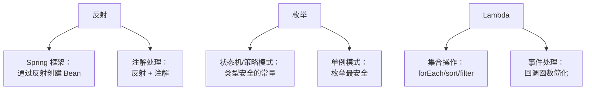

## 本文思维导图

```markmap
---
markmap:
  colorFreezeLevel: 2
  maxWidth: 300
---

# 反射、枚举与 Lambda

## 反射（Reflection）
- 运行时获取类的所有信息
- 核心类
  - Class：类的实体
  - Field：成员变量
  - Method：方法
  - Constructor：构造方法
- 获取 Class 对象三种方式
  - Class.forName("全路径")
  - 类名.class
  - 对象.getClass()
- 应用：Spring 等框架的基础
- 缺点：性能损耗、破坏封装

## 枚举（Enum）
- JDK 1.5 引入
- 本质：继承 java.lang.Enum
- 构造方法默认私有
- 常用方法
  - values()
  - ordinal()
  - valueOf()
  - compareTo()
- 优点：类型安全、内置方法
- 枚举实现单例（反射安全）
- 不可继承、不可扩展

## Lambda 表达式
- JDK 8 引入
- 语法：(参数) -> {方法体}
- 前提：函数式接口
  - 有且只有一个抽象方法
  - @FunctionalInterface 注解
- 语法精简规则
  - 参数类型可省略
  - 单参数可省略括号
  - 单语句可省略大括号
  - 单 return 可省略 return
- 变量捕获
  - 捕获的变量必须 final 或事实 final
- 集合中的应用
  - forEach
  - sort
  - Map.forEach
```

## 学习目标

读完本文，你将能够：

1. 理解反射的原理，能通过反射获取类信息、创建对象、调用方法
2. 正确使用枚举定义常量，理解枚举为什么是单例模式的最佳实践
3. 掌握 Lambda 表达式语法和函数式接口的概念
4. 在集合框架中灵活运用 Lambda 简化代码

> 本系列番外篇：反射、枚举和 Lambda 不属于数据结构本身，但它们是 Java 集合框架源码中大量使用的语言特性。理解这三者，能让你在阅读 JDK 源码时不再卡壳——比如 `Comparator` 为什么能用 Lambda 传入，`EnumSet` 为什么性能极高，Spring 如何通过反射实现依赖注入。

## 反射（Reflection）

### 什么是反射

Java 的反射机制是指在**运行状态**中：

- 对于任意一个类，都能够知道这个类的**所有属性和方法**
- 对于任意一个对象，都能够调用它的**任意方法和属性**

这种动态获取信息以及动态调用对象方法的功能称为 Java 的反射机制。

通俗理解：正常写代码是"我知道这个类是什么，直接 new 出来用"；反射是"我只有一个类名字符串，要在运行时动态创建它、调用它的方法"。

### 反射的核心类

| 类 | 作用 |
|---|------|
| `Class` | 代表类的实体，是反射的入口 |
| `Field` | 代表类的成员变量（属性） |
| `Method` | 代表类的方法 |
| `Constructor` | 代表类的构造方法 |

所有反射相关的类都在 `java.lang.reflect` 包下。

### 获取 Class 对象的三种方式

反射的第一步是获取目标类的 `Class` 对象：

```java
// 假设有一个 Student 类
public class Student {
    private String name;
    public int age;

    private Student(String name, int age) {
        this.name = name;
        this.age = age;
    }

    public void study() {
        System.out.println(name + " is studying");
    }

    private void secret() {
        System.out.println("this is private");
    }
}
```

三种获取 Class 的方式：

```java
// 方式一：Class.forName("全限定类名")——最常用，运行时动态加载
Class<?> clazz1 = Class.forName("com.example.Student");

// 方式二：类名.class——编译时已知类
Class<?> clazz2 = Student.class;

// 方式三：对象.getClass()——已有实例时
Student stu = new Student("Alice", 20);
Class<?> clazz3 = stu.getClass();

// 三种方式获取的是同一个 Class 对象
System.out.println(clazz1 == clazz2); // true
System.out.println(clazz2 == clazz3); // true
```

### 反射的使用

```java
Class<?> clazz = Class.forName("com.example.Student");

// 1. 获取所有属性（包括私有）
Field[] fields = clazz.getDeclaredFields();
for (Field field : fields) {
    System.out.println(field.getName() + " : " + field.getType());
}

// 2. 获取并调用私有构造方法
Constructor<?> constructor = clazz.getDeclaredConstructor(String.class, int.class);
constructor.setAccessible(true); // 突破 private 限制
Object obj = constructor.newInstance("Bob", 22);

// 3. 获取并调用私有方法
Method method = clazz.getDeclaredMethod("secret");
method.setAccessible(true); // 突破 private 限制
method.invoke(obj); // 输出：this is private

// 4. 获取并修改私有字段
Field nameField = clazz.getDeclaredField("name");
nameField.setAccessible(true);
nameField.set(obj, "Charlie");
System.out.println(nameField.get(obj)); // Charlie
```

> `setAccessible(true)` 是反射突破封装的关键——它让你能访问 private 成员。这也是反射被称为"破坏封装"的原因。

### 反射的应用场景

- **Spring 框架**：通过配置文件中的类名，动态创建 Bean 对象
- **MyBatis**：将数据库查询结果自动映射到 Java 对象
- **JUnit**：通过反射找到所有 `@Test` 注解的方法并执行
- **IDE**：代码补全、自动提示都依赖反射获取类信息

### 反射的优缺点

| 优点 | 缺点 |
|------|------|
| 动态性强，运行时才确定类型 | 性能比直接调用慢（约 2-50 倍） |
| 增加程序灵活性和扩展性 | 破坏封装性（能访问 private） |
| 是各种框架的基础 | 代码可读性差，难以调试 |

## 枚举（Enum）

### 为什么需要枚举

在 JDK 1.5 之前，定义一组常量通常这样做：

```java
public static final int RED = 1;
public static final int GREEN = 2;
public static final int BLUE = 3;
```

问题：这些常量本质上只是 `int`，没有类型安全——你可以把 `RED` 传给任何接收 `int` 的方法，编译器不会提醒你传错了。

枚举解决了这个问题：**将一组常量组织起来，赋予它们类型**。

### 基本使用

```java
// 定义枚举
public enum Color {
    RED, GREEN, BLUE
}

// 使用枚举
Color c = Color.RED;
System.out.println(c);        // RED
System.out.println(c.name()); // RED

// switch 中使用枚举
switch (c) {
    case RED:   System.out.println("红色"); break;
    case GREEN: System.out.println("绿色"); break;
    case BLUE:  System.out.println("蓝色"); break;
}
```

### 枚举的本质

枚举的本质是一个类，默认继承 `java.lang.Enum`：

```java
// 枚举可以有字段、构造方法和方法
public enum Season {
    SPRING("春天", "万物复苏"),
    SUMMER("夏天", "骄阳似火"),
    AUTUMN("秋天", "硕果累累"),
    WINTER("冬天", "白雪皑皑");

    private final String name;
    private final String description;

    // 构造方法默认且必须是 private
    Season(String name, String description) {
        this.name = name;
        this.description = description;
    }

    public String getDescription() {
        return description;
    }
}

System.out.println(Season.SPRING.getDescription()); // 万物复苏
```

### 枚举常用方法

| 方法 | 说明 |
|------|------|
| `values()` | 返回所有枚举常量的数组 |
| `ordinal()` | 返回枚举常量的索引（从 0 开始） |
| `valueOf(String name)` | 将字符串转为对应的枚举常量 |
| `compareTo(E other)` | 比较两个枚举的 ordinal 值 |
| `name()` | 返回枚举常量的名称 |

```java
// values() 遍历所有枚举值
for (Color c : Color.values()) {
    System.out.println(c.ordinal() + " : " + c.name());
}
// 0 : RED
// 1 : GREEN
// 2 : BLUE

// valueOf() 字符串转枚举
Color red = Color.valueOf("RED");
```

### 枚举为什么是单例的最佳实践

**面试经典问题**：为什么用枚举实现单例模式是安全的？

```java
// 枚举实现单例
public enum Singleton {
    INSTANCE;

    public void doSomething() {
        System.out.println("单例方法");
    }
}

// 使用
Singleton.INSTANCE.doSomething();
```

枚举单例的三大安全保障：

1. **线程安全**：枚举常量在类加载时初始化，JVM 保证线程安全
2. **反射安全**：JDK 源码中明确禁止通过反射创建枚举实例——`Constructor.newInstance()` 会检查是否是枚举类型，是就直接抛 `IllegalArgumentException`
3. **序列化安全**：枚举的序列化由 JVM 特殊处理，反序列化时不会创建新实例

这是其他单例实现（饿汉式、懒汉式、双重检查锁、静态内部类）都无法同时保证的。

### 枚举的优缺点

| 优点 | 缺点 |
|------|------|
| 类型安全，编译期检查 | 不可继承，无法扩展 |
| 内置实用方法 | 不能在运行时动态添加常量 |
| 天然单例，反射和序列化安全 | 占用内存比普通常量略大 |
| 可以有字段和方法 | |

## Lambda 表达式

### 什么是 Lambda

Lambda 表达式是 Java 8 引入的重要特性，允许你用更简洁的语法来表示**匿名函数**——本质上是对匿名内部类的简化。

对比传统匿名内部类和 Lambda：

```java
// 传统方式：匿名内部类实现 Comparator
Collections.sort(list, new Comparator<String>() {
    @Override
    public int compare(String s1, String s2) {
        return s1.length() - s2.length();
    }
});

// Lambda 方式：一行搞定
Collections.sort(list, (s1, s2) -> s1.length() - s2.length());
```

### Lambda 语法

```
(参数列表) -> { 方法体 }
```

三部分：
- **参数列表**：函数式接口中抽象方法的参数
- **箭头 `->`**：分隔参数和方法体
- **方法体**：具体实现（可以是表达式或代码块）

### 函数式接口

Lambda 的前提是**函数式接口**——有且仅有一个抽象方法的接口：

```java
// 这就是一个函数式接口
@FunctionalInterface
interface MyFunction {
    int apply(int a, int b);
}

// 使用 Lambda 实现
MyFunction add = (a, b) -> a + b;
MyFunction multiply = (a, b) -> a * b;

System.out.println(add.apply(3, 4));      // 7
System.out.println(multiply.apply(3, 4)); // 12
```

`@FunctionalInterface` 注解不是必须的，但加上后编译器会帮你检查——如果接口有多个抽象方法就报错。

JDK 内置的常用函数式接口：

| 接口 | 方法 | 用途 |
|------|------|------|
| `Comparator<T>` | `compare(T, T)` | 比较两个对象 |
| `Runnable` | `run()` | 无参无返回值 |
| `Consumer<T>` | `accept(T)` | 消费一个对象（无返回） |
| `Supplier<T>` | `get()` | 提供一个对象（无参） |
| `Function<T, R>` | `apply(T)` | 转换：T → R |
| `Predicate<T>` | `test(T)` | 判断：T → boolean |

### 语法精简规则

```java
// 完整形式
(int a, int b) -> { return a + b; }

// 规则 1：参数类型可省略（编译器自动推断）
(a, b) -> { return a + b; }

// 规则 2：只有一个参数时，括号可省略
a -> { return a * 2; }

// 规则 3：方法体只有一条语句时，大括号可省略
(a, b) -> a + b

// 规则 4：方法体只有一条 return 语句时，return 和大括号都省略
// （规则 3 和 4 配合使用）
(a, b) -> a + b  // 而不是 (a, b) -> { return a + b; }
```

### 变量捕获

Lambda 可以使用外部的局部变量，但该变量必须是 **final** 或**事实上 final**（声明后没有被修改过）：

```java
int factor = 2; // 事实上 final（没有被修改）

MyFunction doubler = a -> a * factor; // ✅ 可以捕获 factor
System.out.println(doubler.apply(5)); // 10

// ❌ 如果修改了 factor，Lambda 中就不能使用
// factor = 3; // 取消注释后，上面的 Lambda 编译报错
```

为什么有这个限制？Lambda 捕获的是变量的**副本**（值拷贝），如果原始变量可以修改，副本和原始值就会不一致，导致语义混乱。

### Lambda 在集合中的应用

#### forEach 遍历

```java
List<String> list = Arrays.asList("Hello", "World", "Lambda");

// 传统方式
for (String s : list) {
    System.out.println(s);
}

// Lambda 方式
list.forEach(s -> System.out.println(s));

// 方法引用（更简洁）
list.forEach(System.out::println);
```

#### List.sort 排序

```java
List<String> list = new ArrayList<>(Arrays.asList("banana", "apple", "cherry"));

// Lambda 方式
list.sort((s1, s2) -> s1.compareTo(s2));

// 方法引用
list.sort(String::compareTo);

// 按长度排序
list.sort((s1, s2) -> Integer.compare(s1.length(), s2.length()));

// 使用 Comparator 工厂方法
list.sort(Comparator.comparingInt(String::length));
```

#### Map.forEach 遍历键值对

```java
Map<Integer, String> map = new HashMap<>();
map.put(1, "hello");
map.put(2, "world");
map.put(3, "lambda");

// Lambda 方式遍历 Map
map.forEach((key, value) -> System.out.println(key + " = " + value));
```

#### Stream API（Lambda 的进阶应用）

```java
List<Integer> numbers = Arrays.asList(1, 2, 3, 4, 5, 6, 7, 8, 9, 10);

// 筛选偶数、平方、求和
int sum = numbers.stream()
    .filter(n -> n % 2 == 0)      // 筛选偶数
    .map(n -> n * n)               // 平方
    .reduce(0, Integer::sum);      // 求和
System.out.println(sum); // 4+16+36+64+100 = 220
```

### Lambda 的优缺点

| 优点 | 缺点 |
|------|------|
| 代码简洁，开发迅速 | 代码可读性可能变差（过度简化时） |
| 方便函数式编程 | 调试不如普通代码方便 |
| 与 Stream API 配合强大 | 初学者学习曲线较陡 |
| 利于并行计算 | 非并行场景未必比传统方式快 |

## 三者的关系

反射、枚举和 Lambda 在实际开发和框架中经常组合使用：



- **反射 + 枚举**：反射不能创建枚举实例——这保证了枚举单例的安全性
- **反射 + Lambda**：Spring 等框架用反射发现接口，Lambda 简化实现
- **枚举 + Lambda**：枚举可以配合函数式接口做策略模式

## 小结

| 特性 | 核心价值 | 关键限制 |
|------|---------|---------|
| 反射 | 运行时动态操作类，框架的基石 | 性能损耗、破坏封装 |
| 枚举 | 类型安全的常量，最安全的单例 | 不可继承、不可扩展 |
| Lambda | 简化匿名类，函数式编程入口 | 只能用于函数式接口 |

**关键认知**：

- 反射能力很强但不要滥用——日常业务代码几乎不需要反射，它是"框架开发者的工具"
- 枚举不只是常量——它是类，可以有字段、方法，是实现单例和状态机的利器
- Lambda 不是万能简化——当逻辑复杂时（超过 3 行），老老实实写具名方法更清晰
- 这三者的面试频率都很高——反射问原理和框架应用，枚举问单例安全性，Lambda 问函数式接口和变量捕获

**配套练习**：

- 用反射获取 `String` 类的所有方法名，打印出来
- 用枚举实现一个线程安全的单例，并尝试用反射创建第二个实例（观察报错）
- 用 Lambda + Stream 实现：给定一组学生对象，筛选出年龄 > 20 的，按成绩降序排列，取前 3 名的姓名
- 思考：为什么 `Comparator` 有两个抽象方法（`compare` 和 `equals`），但仍然是函数式接口？
