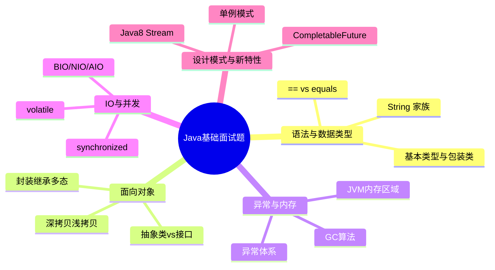

## 📚 系列总览

本系列围绕 **社招 3-5 年 Java 开发**岗位，梳理 Java 基础高频面试题。每篇按 A / B / C 三级热度划分，配合追问连环套和记忆锚点，帮助你建立可复述的知识体系。

---

## 📖 文章索引

| 序号 | 文章 | 核心内容 | 题数 |
|------|------|----------|------|
| 01 | [语法与数据类型](../01-syntax-and-types/) | == vs equals、int vs Integer、String/StringBuilder、BigDecimal | 9 |
| 02 | [面向对象编程](../02-oop/) | 封装继承多态、抽象类vs接口、深拷贝浅拷贝、泛型、反射 | 10 |
| 03 | [异常处理与内存管理](../03-exception-and-memory/) | 异常体系、JVM内存区域、GC算法、OOM排查、类加载 | 8 |
| 04 | [I/O与基础并发](../04-io-and-concurrency/) | BIO/NIO/AIO、volatile、synchronized、线程基础、序列化 | 9 |
| 05 | [设计模式与新特性](../05-design-patterns/) | 单例DCL、代理模式、策略/责任链、Stream API、CompletableFuture | 9 |

**总计：45 题**（A级 13 题 · B级 17 题 · C级 15 题）

---

## 🔥 热度分布

| 等级 | 数量 | 特征 | 准备策略 |
|------|------|------|----------|
| A级 🔥🔥🔥 | 13 | 必考题，3 层追问 | 逐层吃透，能讲 3 分钟 |
| B级 🔥🔥 | 17 | 高频题，2 层追问 | 掌握核心 + 一层延伸 |
| C级 🔥 | 15 | 基础题，直答即可 | 记住结论，30 秒内回答 |

---

## 🎯 使用建议

1. **首轮复习**：按顺序过一遍所有 A 级题，确保核心区能完整复述
2. **二轮深化**：攻克 A 级追问 + B 级基础提问
3. **考前速查**：翻阅 [锚点速查表](../99-anchor-cheatsheet/)，用触发词回忆完整答案
4. **模拟面试**：随机抽题，限时口述，检验输出流畅度

---

## 📋 全局锚点速查

完整的记忆锚点汇总见 → [99-anchor-cheatsheet](../99-anchor-cheatsheet/)
