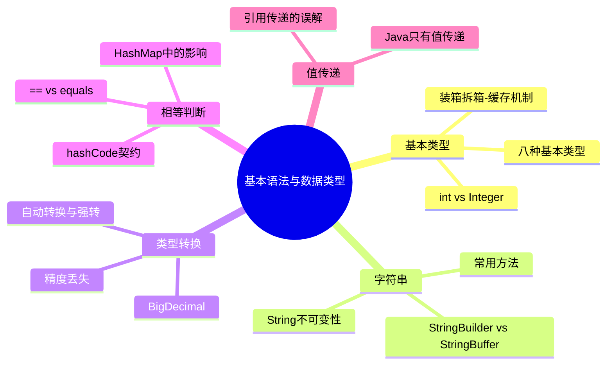

> **本节高频 TOP5**
> 1. == vs equals vs hashCode 🔥🔥🔥
> 2. int vs Integer（装箱拆箱/缓存）🔥🔥🔥
> 3. String/StringBuilder/StringBuffer 区别 🔥🔥
> 4. 八种基本数据类型 🔥🔥
> 5. BigDecimal vs double 🔥🔥

---

## A级题

---

### Q1：== 和 equals 有什么区别？hashCode 和 equals 什么关系？ ⭐⭐ | 🔥🔥🔥 | A级

**考察能力**：[基础知识] + [编码能力]（验证候选人是否理解 Java 对象相等性判断的底层机制，以及在集合中的实际影响）

#### 核心区（快速复习）

🟢 **基础提问**："== 和 equals 有什么区别？为什么重写 equals 一定要重写 hashCode？"

**必答要点**
- [核心] `==` 比较基本类型的值或引用类型的内存地址，`equals` 比较对象逻辑相等
- [原理] Object 默认的 equals 就是 `==`，String/Integer 等重写了 equals 比较内容
- [边界] hashCode 契约：equals 为 true 则 hashCode 必须相同；hashCode 相同 equals 不一定为 true
- [影响] 不重写 hashCode → HashMap 中逻辑相同的 key 散列到不同桶 → get 返回 null

**示例回答**

`==` 对基本类型比较值，对引用类型比较的是内存地址，也就是是不是同一个对象。`equals` 是 Object 的方法，默认实现也是 `==`，但 String、Integer 这些类重写了它来比较内容。

hashCode 和 equals 的关系靠一个契约维持：如果两个对象 equals 为 true，它们的 hashCode 必须相同。反过来不要求——hashCode 相同可能只是碰撞。HashMap 先用 hashCode 定位桶，再用 equals 精确匹配。如果只重写 equals 不重写 hashCode，逻辑上相等的两个对象可能落到不同桶，导致 `map.get(key)` 返回 null。

**记忆锚点**
> "==看地址，equals看内容；hash定桶，equals定值"
>
> 展开触发词：引用比较、契约、HashMap桶定位

---

#### 深化区（追问准备）

🔴 **追问连环套**
- L1: "String s1 = new String('a'); String s2 = new String('a'); s1 == s2 返回什么？s1.equals(s2) 呢？" → `==` 为 false（两个不同堆对象），`equals` 为 true（String 重写了按字符比较）
  - 💡 面试官此时在验证：是否清楚 new String 绕过常量池
  - L2: "如果我用 String s3 = 'a'; s1 == s3 呢？intern() 方法做了什么？" → false，因为 s1 在堆上 s3 在常量池。`intern()` 返回常量池中的引用，如果池中没有则放入
    - 💡 面试官此时在验证：对字符串常量池的理解
    - L3: "HashMap 用自定义对象做 key，只重写了 equals 没重写 hashCode，会发生什么？" → put 和 get 用的 key 即使逻辑相同，hashCode 不同导致散列到不同位置，get 时找不到之前 put 的数据
      - 💡 面试官此时在验证：能否将理论知识映射到工程实际问题

**踩坑提醒**
- ❌ "equals 比较的是值" → ✅ Object 默认 equals 就是 `==`，只有重写后才比较值/内容
- ❌ "hashCode 相同就是同一个对象" → ✅ hashCode 只决定桶位置，equals 才决定相等

**加分项**
- 了解 JDK 7+ String 常量池从永久代移到了堆中
- 知道 `Objects.equals(a, b)` 可以空安全比较，避免 NPE
- 提到 IDE 可以自动生成 equals/hashCode，推荐用 `Objects.hash()` 实现

**项目结合**
> 场景：使用自定义 DTO 作为缓存 Map 的 key
> 排查：缓存命中率异常低，debug 发现相同参数的请求每次都 miss
> 方案：补上 hashCode 重写（用 Objects.hash 包装关键字段），加单元测试验证
> 效果：缓存命中率从 12% 恢复到 85%
> ⚠️ 面试官会追问：hashCode 用了哪些字段？mutable 字段能不能参与 hashCode？

---

### Q2：int 和 Integer 有什么区别？说说装箱拆箱和 Integer 缓存 ⭐⭐ | 🔥🔥🔥 | A级

**考察能力**：[基础知识] + [编码能力]（验证对基本类型与包装类的理解，以及自动装箱的性能陷阱）

#### 核心区（快速复习）

🟢 **基础提问**："int 和 Integer 的区别是什么？什么是自动装箱拆箱？Integer 缓存了解吗？"

**必答要点**
- [核心] int 是基本类型（栈上，默认值 0），Integer 是包装类（堆上对象，默认值 null）
- [原理] 自动装箱 = `Integer.valueOf()`，自动拆箱 = `intValue()`；编译器语法糖
- [边界] `Integer.valueOf()` 对 -128~127 做了缓存，该范围内返回同一对象
- [陷阱] Integer 与 int 用 `==` 比较时会自动拆箱，但两个 Integer 用 `==` 比较是地址比较

**示例回答**

int 是 Java 8种基本类型之一，占 4 字节，直接存值，默认值是 0。Integer 是 int 的包装类，是对象，存在堆上，默认值 null，可以用在泛型中。

自动装箱就是编译器帮你把 `int` 转成 `Integer`，底层调的是 `Integer.valueOf()`。拆箱反过来，调 `intValue()`。这里有个缓存机制：`valueOf()` 对 -128 到 127 范围内的值直接返回缓存对象，所以 `Integer a = 127; Integer b = 127; a == b` 是 true，但换成 128 就是 false。

实际开发中要注意：两个 Integer 比较一定要用 `equals`，不要用 `==`。另外在循环中大量使用 Integer 累加会产生很多临时对象，影响 GC。

**记忆锚点**
> "int栈值0，Integer堆null；valueOf缓存-128到127"
>
> 展开触发词：装箱valueOf、拆箱intValue、缓存范围

---

#### 深化区（追问准备）

🔴 **追问连环套**
- L1: "Integer a = 127, b = 127; a == b? 换成 128 呢？为什么？" → 127 是 true（缓存同一对象），128 是 false（new 了两个对象）
  - 💡 面试官此时在验证：是否真正理解缓存机制而不只是背结论
  - L2: "Integer 缓存范围能改吗？怎么改？" → 上界可以通过 JVM 参数 `-XX:AutoBoxCacheMax=<size>` 或系统属性 `java.lang.Integer.IntegerCache.high` 调整，下界固定 -128
    - 💡 面试官此时在验证：是否读过源码或者做过调优
    - L3: "在高并发场景下用 Integer 做锁对象有什么风险？" → 缓存范围内多个线程拿到同一个 Integer 对象，synchronized 会产生意外竞争；应该用专门的 Object 做锁
      - 💡 面试官此时在验证：能否将包装类知识关联到并发安全

**踩坑提醒**
- ❌ "Integer == int 比较的是地址" → ✅ Integer 与 int 比较时 Integer 会自动拆箱，变成值比较，结果 true
- ❌ "new Integer(127) == Integer.valueOf(127) 是 true" → ✅ new 绕过缓存创建新对象，`==` 为 false

**加分项**
- 知道 Long/Short/Byte 也有类似缓存（-128~127），但 Float/Double 没有
- 了解 JDK 9+ 标记 `new Integer()` 为 deprecated，推荐用 `Integer.valueOf()`

**项目结合**
> 场景：循环中用 Integer 累加计数导致频繁 Young GC
> 排查：jstat 观察到 Eden 区快速填满，Arthas 火焰图显示大量 Integer.valueOf
> 方案：改用 int 基本类型或 AtomicInteger
> 效果：Young GC 次数减少 60%，接口 P99 延迟下降 15ms
> ⚠️ 面试官会追问：什么场景必须用 Integer 不能用 int？（泛型容器、ORM 映射允许 null）

---

## B级题

---

### Q3：八种基本数据类型分别是什么？各占多少字节？ ⭐ | 🔥🔥 | B级

**考察能力**：[基础知识]（验证基本功是否扎实）

🟢 **基础提问**："Java 有哪八种基本数据类型？"

**必答要点**
- [核心] 整数：byte(1) / short(2) / int(4) / long(8)；浮点：float(4) / double(8)；字符：char(2)；布尔：boolean(JVM 未严格规定，通常 1 字节)
- [补充] boolean 在数组中占 1 字节，单独使用时 JVM 实现可能用 int（4 字节）
- [关联] 每种基本类型都有对应的包装类

**示例回答**

Java 有 8 种基本类型：4 种整数型 byte、short、int、long，分别是 1、2、4、8 字节；2 种浮点型 float 和 double，4 字节和 8 字节；1 种字符型 char 占 2 字节（UTF-16 编码单元）；1 种布尔型 boolean。int 和 double 是最常用的，日常开发整数默认 int，小数默认 double。

🔴 **追问连环套**
- L1: "int 是多少位？能表示的范围？" → 32 位，-2^31 到 2^31-1（约 ±21 亿）
  - 💡 面试官此时在验证：是否清楚补码表示和溢出边界
  - L2: "long 和 int 互转会有什么问题？" → long 转 int 可能截断高位丢失数据；int 转 long 安全（自动拓宽）

**踩坑提醒**
- ❌ "boolean 占 1 位" → ✅ JVM 规范未明确 boolean 大小，HotSpot 中通常按 int 或 byte 处理

**记忆锚点**
> "1-2-4-8整数线，4-8浮点线，char2布尔特殊"

---

### Q4：String、StringBuilder、StringBuffer 的区别？ ⭐⭐ | 🔥🔥 | B级

**考察能力**：[基础知识] + [编码能力]（验证对不可变性和线程安全的理解）

🟢 **基础提问**："String、StringBuilder、StringBuffer 有什么区别？分别在什么场景用？"

**必答要点**
- [核心] String 不可变（final char[]/byte[]），每次修改产生新对象
- [对比] StringBuilder 可变、非线程安全、性能高；StringBuffer 可变、线程安全（方法加 synchronized）、性能略低
- [选型] 单线程拼接用 StringBuilder，多线程共享用 StringBuffer，少量拼接直接 String

**示例回答**

String 是不可变的，底层用 `final` 修饰的数组存储（JDK 9+ 是 byte[]）。每次对 String 做拼接/替换都会创建新对象，频繁操作性能差。

StringBuilder 和 StringBuffer 都是可变字符序列，内部数组可扩容。区别是 StringBuffer 的方法加了 `synchronized`，线程安全但慢。实际开发中 99% 的场景用 StringBuilder 就够了，因为字符串拼接很少在多线程中共享同一个 builder。

另外，编译器对 `+` 拼接会优化成 StringBuilder（JDK 5+），但在循环中拼接仍然会每次 new 一个 StringBuilder，所以循环内还是要手动用。

🔴 **追问连环套**
- L1: "String 为什么设计成不可变的？" → 安全性（作为HashMap的key、类加载器参数）、线程安全、字符串常量池复用
  - 💡 面试官此时在验证：是否理解不可变设计的多维度考量
  - L2: "JDK 9 对 String 做了什么优化？" → Compact Strings：底层从 char[] 改为 byte[]，Latin-1 字符用单字节存储，节省约 50% 内存

**踩坑提醒**
- ❌ "循环中用 + 拼接没关系，编译器会优化" → ✅ 循环内每次迭代都会创建新 StringBuilder 对象，应手动在循环外创建

**记忆锚点**
> "String不变安全池，Builder快，Buffer锁"

---

### Q5：为什么用 BigDecimal 不用 double？ ⭐⭐ | 🔥🔥 | B级

**考察能力**：[基础知识] + [编码能力]（验证浮点精度问题的理解和实际处理能力）

🟢 **基础提问**："为什么金额计算不能用 double？BigDecimal 怎么用？"

**必答要点**
- [核心] double 是 IEEE 754 浮点数，二进制无法精确表示某些十进制小数（如 0.1），存在精度丢失
- [方案] BigDecimal 用字符串或整数表示精确值，适合金融/财务场景
- [陷阱] `new BigDecimal(0.1)` 仍有精度问题，必须用 `BigDecimal.valueOf(0.1)` 或 `new BigDecimal("0.1")`

**示例回答**

double 遵循 IEEE 754 标准，用二进制浮点表示。0.1 在二进制中是无限循环小数，存储时会截断，导致 `0.1 + 0.2 != 0.3`。金额计算如果用 double，累积误差可能导致对账差一分钱。

BigDecimal 可以精确表示十进制数。但注意要用字符串构造或 `valueOf`，不要用 `new BigDecimal(double)`，否则精度问题会被带进来。除法时必须指定精度和舍入模式（`RoundingMode.HALF_UP`），否则遇到除不尽的情况会抛 ArithmeticException。

🔴 **追问连环套**
- L1: "BigDecimal 比较大小用什么？equals 可以吗？" → 用 `compareTo`，因为 `equals` 会比较精度（`1.0` 和 `1.00` equals 为 false）
  - 💡 面试官此时在验证：是否踩过实际的坑
  - L2: "BigDecimal 性能怎么样？有没有替代方案？" → 性能较差（对象创建 + 大数运算），高性能场景可以用 long 存分（整数运算），展示时再除以 100

**踩坑提醒**
- ❌ "new BigDecimal(0.1) 就是精确的 0.1" → ✅ 传入的 double 本身已经丢失精度，必须用字符串 "0.1"

**记忆锚点**
> "double有限位截断，BigDecimal字符串构造，compareTo比大小"

---

### Q6：Java 中数据类型转换有哪些方式？会出什么问题？ ⭐ | 🔥🔥 | B级

**考察能力**：[基础知识]（验证对类型安全机制的理解）

🟢 **基础提问**："Java 数据类型转换怎么做？什么时候会有精度丢失？"

**必答要点**
- [核心] 自动类型转换（隐式）：小→大，如 int→long→double
- [核心] 强制类型转换（显式）：大→小，如 `(int) longValue`，可能截断
- [边界] int→float 可能丢精度（float 有效位只有 23 位，约 7 位十进制）；long→double 同理

**示例回答**

Java 类型转换分两种。自动转换发生在小类型赋给大类型时（byte→short→int→long→float→double），编译器自动拓宽，不丢失数据（但 int→float、long→double 可能丢精度）。强制转换是大类型赋给小类型，需要显式 cast，超出范围会截断高位。

比较容易忽略的是 int 到 float 的精度丢失：int 有 32 位精度，float 尾数只有 23 位，当 int 值超过 2^24 时转 float 就会损失精度。

🔴 **追问连环套**
- L1: "byte b = 128 能编译通过吗？" → 不能，byte 范围 -128~127，128 超出。但 `byte b = (byte)128` 可以，结果是 -128（溢出）
  - 💡 面试官此时在验证：对补码溢出的理解
  - L2: "short s = 1; s = s + 1 能编译吗？s += 1 呢？" → 前者不行（s+1 提升为 int），后者可以（`+=` 隐含强制转换）

**踩坑提醒**
- ❌ "自动转换一定不丢精度" → ✅ int→float、long→double 都可能丢失精度

**记忆锚点**
> "小到大自动，大到小强转截断；int转float也丢精"

---

## C级题

---

### Q7：Java 是值传递还是引用传递？ ⭐ | 🔥 | C级

**考察能力**：[基础知识]

🟢 **基础提问**："Java 的参数传递是值传递还是引用传递？"

**核心回答**

Java 只有值传递。基本类型传的是值的副本，引用类型传的是引用（地址）的副本。所以方法内修改引用指向不影响外部，但通过引用修改对象内部状态会影响外部。

**记忆锚点**
> "传的是副本：int传值副本，对象传地址副本"

---

### Q8：说一下 Java 的特点 / 为什么 Java 是跨平台的？ ⭐ | 🔥 | C级

**考察能力**：[基础知识]

🟢 **基础提问**："Java 为什么能跨平台？JVM、JDK、JRE 什么关系？"

**核心回答**

Java 源码编译成字节码（.class），由不同平台的 JVM 解释/JIT编译执行，实现"一次编写，到处运行"。JDK 包含 JRE 和开发工具（javac 等），JRE 包含 JVM 和核心类库。JVM 是运行字节码的虚拟机，是跨平台的关键。

**记忆锚点**
> "源码→字节码→JVM解释；JDK包JRE包JVM"

---

### Q9：Java 创建对象有哪些方式？ ⭐ | 🔥 | C级

**考察能力**：[基础知识]

🟢 **基础提问**："Java 中创建对象除了 new 还有什么方式？"

**核心回答**

5 种方式：1) `new` 关键字；2) 反射 `Class.newInstance()` 或 `Constructor.newInstance()`；3) `clone()` 方法；4) 反序列化（ObjectInputStream）；5) Unsafe.allocateInstance()（不推荐）。其中只有 new 和反射会调用构造方法。

**记忆锚点**
> "new反射clone序列化Unsafe，前两个调构造"

---

## 锚点速查汇总

| # | 题目 | 锚点 | 展开触发词 |
|---|------|------|-----------|
| Q1 | == vs equals vs hashCode | ==看地址，equals看内容；hash定桶，equals定值 | 引用比较、契约、HashMap桶定位 |
| Q2 | int vs Integer | int栈值0，Integer堆null；valueOf缓存-128到127 | 装箱valueOf、拆箱intValue、缓存范围 |
| Q3 | 八种基本类型 | 1-2-4-8整数线，4-8浮点线，char2布尔特殊 | 字节数、范围、默认值 |
| Q4 | String三兄弟 | String不变安全池，Builder快，Buffer锁 | 不可变性、线程安全、循环拼接 |
| Q5 | BigDecimal | double有限位截断，BigDecimal字符串构造，compareTo比大小 | IEEE754、精度丢失、构造方式 |
| Q6 | 类型转换 | 小到大自动，大到小强转截断；int转float也丢精 | 隐式拓宽、显式截断、有效位 |
| Q7 | 值传递 | 传的是副本：int传值副本，对象传地址副本 | 副本、引用修改、指向不变 |
| Q8 | 跨平台 | 源码→字节码→JVM解释；JDK包JRE包JVM | 编译、字节码、虚拟机 |
| Q9 | 创建对象 | new反射clone序列化Unsafe，前两个调构造 | 构造方法、绕过构造 |
