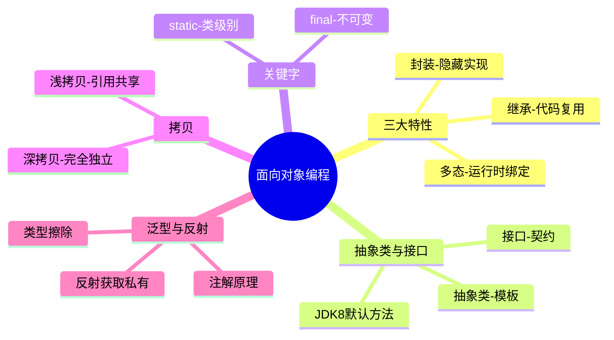

> **本节高频 TOP5**
> 1. 封装继承多态（多态实现原理）🔥🔥🔥
> 2. 抽象类 vs 接口 🔥🔥🔥
> 3. 重载 vs 重写 🔥🔥
> 4. 深拷贝与浅拷贝 🔥🔥
> 5. 反射机制与应用场景 🔥🔥

---

## A级题

---

### Q1：怎么理解面向对象？说说封装继承多态 ⭐⭐ | 🔥🔥🔥 | A级

**考察能力**：[基础知识] + [方案设计]（验证候选人对 OOP 核心思想的理解深度，以及能否联系实际应用）

#### 核心区（快速复习）

🟢 **基础提问**："怎么理解面向对象？简单说说封装、继承、多态"

**必答要点**
- [核心] 封装：将数据和行为绑定，对外暴露接口隐藏实现，通过访问修饰符控制可见性
- [核心] 继承：子类复用父类代码和行为，is-a 关系，Java 单继承（接口多实现）
- [核心] 多态：同一消息不同对象有不同行为。编译时看声明类型，运行时看实际类型（动态绑定）
- [实现] 多态三要素：继承/实现、方法重写、父类引用指向子类对象

**示例回答**

面向对象把现实世界抽象成对象，通过对象间的协作完成功能。核心三大特性：

封装是把数据和操作数据的方法放在一起，用 private 保护内部状态，只暴露必要的 public 方法。好处是修改内部实现不影响外部调用方。

继承让子类拥有父类的属性和方法，实现代码复用。Java 是单继承，但可以通过接口实现多重契约。继承要慎用，优先考虑组合（composition over inheritance）。

多态是同一个方法调用，根据实际对象类型执行不同逻辑。实现多态需要三个条件：有继承或实现关系、子类重写了父类方法、用父类引用指向子类对象。JVM 在运行时通过 invokevirtual 指令在方法表中查找实际类型的方法，这就是动态绑定。

**记忆锚点**
> "封装藏实现，继承复用is-a，多态运行时绑定三要素"
>
> 展开触发词：访问修饰符、单继承、invokevirtual

---

#### 深化区（追问准备）

🔴 **追问连环套**
- L1: "多态体现在哪几个方面？" → 方法重写（运行时多态）和方法重载（编译时多态）。还有向上转型后父类引用调子类方法
  - 💡 面试官此时在验证：是否知道编译时多态和运行时多态的区别
  - L2: "多态的底层是怎么实现的？JVM 怎么知道该调哪个方法？" → JVM 用 vtable（虚方法表），每个类维护一张表存储方法入口地址。调用时根据对象头中的类型指针找到实际类的 vtable，再定位方法
    - 💡 面试官此时在验证：是否了解 JVM 层面的方法分派机制
    - L3: "静态方法有多态吗？为什么？" → 没有。静态方法在编译期就确定了调用目标（invokestatic），不参与动态绑定。子类定义同签名静态方法是隐藏（hide）不是重写
      - 💡 面试官此时在验证：对方法分派指令（invokevirtual vs invokestatic）的区分

**踩坑提醒**
- ❌ "重载是多态" → ✅ 严格来说重载是编译时多态（ad-hoc polymorphism），面试中提到多态主要指运行时多态（重写 + 动态绑定）
- ❌ "Java 支持多继承" → ✅ Java 类单继承，接口多实现。JDK 8+ 接口 default 方法引入了"菱形问题"需显式指定

**加分项**
- 提到组合优于继承的设计原则（Effective Java Item 18）
- 了解 JDK 17 sealed classes 对继承层次的限制

**项目结合**
> 场景：支付系统中有多种支付方式（微信/支付宝/银行卡）
> 方案：定义 PaymentStrategy 接口，各实现类重写 pay() 方法，工厂按类型返回具体实现
> 效果：新增支付方式只需加实现类 + 配置，核心流程零修改
> ⚠️ 面试官会追问：为什么用接口不用抽象类？如果有公共逻辑怎么办？

---

### Q2：抽象类和接口有什么区别？什么时候用哪个？ ⭐⭐ | 🔥🔥🔥 | A级

**考察能力**：[基础知识] + [方案设计]（验证对抽象层次设计的理解和实际选型能力）

#### 核心区（快速复习）

🟢 **基础提问**："Java 中抽象类和接口有什么区别？分别适合什么场景？"

**必答要点**
- [核心] 抽象类：可以有构造器、成员变量、具体方法；单继承；is-a 关系，提供模板
- [核心] 接口：JDK 8 前只有抽象方法和常量；多实现；can-do 关系，定义契约/能力
- [JDK8+] 接口可以有 default 方法和 static 方法，JDK 9+ 可以有 private 方法
- [选型] 有共享状态/构造逻辑 → 抽象类；定义能力契约/需要多实现 → 接口

**示例回答**

从语法层面：抽象类用 abstract class，可以有构造方法、成员变量、具体方法实现，但只能单继承。接口用 interface，JDK 8 之前只能有抽象方法和 public static final 常量，JDK 8 加了 default 和 static 方法，JDK 9 加了 private 方法。类可以实现多个接口。

从设计层面：抽象类表达 is-a 关系，适合有公共状态和行为的模板（比如 AbstractList）。接口表达 can-do / has-a 能力（比如 Serializable、Comparable），适合定义跨层次的契约。

实际选型：如果需要共享字段或构造逻辑，用抽象类。如果只定义行为规范且需要多实现，用接口。JDK 8 之后两者界限模糊了，但核心区别仍然是"状态"——接口不能有实例变量。

**记忆锚点**
> "抽象类有状态能构造is-a模板，接口无状态多实现can-do契约"
>
> 展开触发词：构造器、成员变量、default方法、单继承vs多实现

---

#### 深化区（追问准备）

🔴 **追问连环套**
- L1: "接口里面可以定义哪些方法？" → 抽象方法（默认 public abstract）、default 方法（JDK8）、static 方法（JDK8）、private 方法（JDK9），不能有构造方法
  - 💡 面试官此时在验证：对 JDK 版本演进的了解
  - L2: "一个类实现两个接口，两个接口有同名 default 方法，会怎样？" → 编译报错，必须在实现类中显式重写该方法，可以用 `InterfaceA.super.method()` 选择调哪个
    - 💡 面试官此时在验证：是否了解菱形继承问题的解决方式
    - L3: "抽象类能加 final 修饰吗？能被实例化吗？" → 不能加 final（final 禁止继承，抽象类必须被继承才有意义，矛盾）。不能直接实例化，但可以通过匿名内部类实现后创建对象
      - 💡 面试官此时在验证：对修饰符语义冲突的理解

**踩坑提醒**
- ❌ "JDK 8 之后接口和抽象类没区别了" → ✅ 接口仍然不能有实例变量和构造方法，这是根本区别
- ❌ "接口的变量是普通变量" → ✅ 接口中的变量默认是 public static final（常量）

**加分项**
- 提到 JDK 17 sealed interface 可以限制实现者范围
- 知道 Spring 中大量使用接口（如 BeanFactory）做依赖倒置

**项目结合**
> 场景：日志框架设计——定义 Logger 接口 + AbstractLogger 抽象类
> 方案：接口定义 info/warn/error 方法契约；抽象类实现公共格式化逻辑、持有配置字段；具体类（FileLogger/ConsoleLogger）只实现写出逻辑
> 效果：新增日志输出方式只需继承抽象类，公共逻辑不重复
> ⚠️ 面试官会追问：为什么不直接用接口 default 方法代替抽象类？

---

## B级题

---

### Q3：重载和重写有什么区别？ ⭐⭐ | 🔥🔥 | B级

**考察能力**：[基础知识]（验证对方法分派时机的理解）

🟢 **基础提问**："重载和重写有什么区别？"

**必答要点**
- [核心] 重载（Overload）：同类中方法名相同，参数列表不同（类型/个数/顺序），与返回值无关，编译时确定
- [核心] 重写（Override）：子类重新定义父类方法，方法签名相同，运行时确定（动态绑定）
- [约束] 重写要求：访问权限 ≥ 父类，返回类型协变（子类型），异常不能比父类更宽

**示例回答**

重载是同一个类中方法名相同但参数不同，编译器根据参数类型静态选择调用哪个版本。重写是子类重新实现父类的方法，运行时根据对象实际类型决定调用版本。

重写有三个约束："两同两小一大"——方法名和参数列表相同；返回类型和抛出异常可以是子类型（更小）；访问权限不能更严格（更大或相等）。

🔴 **追问连环套**
- L1: "能只靠返回值类型不同来重载吗？" → 不能，编译器通过方法名+参数列表确定调用目标，返回值不参与匹配
  - 💡 面试官此时在验证：是否清楚方法签名的定义
  - L2: "private/static/final 方法能被重写吗？" → 都不能。private 子类不可见，static 是隐藏不是重写，final 禁止重写

**踩坑提醒**
- ❌ "返回值不同也是重载" → ✅ 重载只看参数列表，返回值不同不构成重载（编译报错）

**记忆锚点**
> "重载编译看参数，重写运行看对象；两同两小一大"

---

### Q4：深拷贝和浅拷贝有什么区别？怎么实现深拷贝？ ⭐⭐ | 🔥🔥 | B级

**考察能力**：[基础知识] + [编码能力]（验证对对象引用关系和内存模型的理解）

🟢 **基础提问**："深拷贝和浅拷贝有什么区别？实现深拷贝有哪些方式？"

**必答要点**
- [核心] 浅拷贝：复制对象本身，但内部引用字段仍指向同一对象（共享引用）
- [核心] 深拷贝：递归复制对象及其所有引用对象，完全独立，互不影响
- [实现] 三种方式：1) 重写 clone() 逐层拷贝；2) 序列化/反序列化；3) 手动 new + 赋值

**示例回答**

浅拷贝只复制一层：新对象的基本类型字段是独立副本，但引用类型字段和原对象指向同一个子对象。修改子对象两边都受影响。Object.clone() 默认就是浅拷贝。

深拷贝是递归复制整个对象图，新旧对象完全独立。实现方式：1) 重写 clone 方法，在里面对每个引用字段也调用 clone；2) 通过序列化（对象 → 字节流 → 新对象），简单但性能差；3) 手动构造新对象逐字段赋值，最可控。

🔴 **追问连环套**
- L1: "Cloneable 接口为什么被认为是有缺陷的设计？" → 它是标记接口，不含 clone 方法；clone 是 Object 的 protected 方法，需要强转返回类型；且默认浅拷贝容易出错。Effective Java 建议用拷贝构造器或工厂替代
  - 💡 面试官此时在验证：是否了解 Java 设计缺陷和业界最佳实践
  - L2: "序列化实现深拷贝有什么问题？" → 性能差（IO 开销大）、要求所有对象都实现 Serializable、transient 字段会丢失

**踩坑提醒**
- ❌ "clone 就是深拷贝" → ✅ Object.clone() 默认是浅拷贝，需要自己递归处理引用字段

**记忆锚点**
> "浅拷贝共享子对象，深拷贝完全独立；clone默认浅，序列化能深但慢"

---

### Q5：static 和 final 关键字分别有什么作用？ ⭐ | 🔥🔥 | B级

**考察能力**：[基础知识]（验证对类成员生命周期和不可变语义的理解）

🟢 **基础提问**："Java 中 static 和 final 分别有什么作用？"

**必答要点**
- [static] 修饰变量 → 类变量（所有实例共享）；修饰方法 → 类方法（无需实例调用）；修饰代码块 → 类加载时执行一次；修饰内部类 → 不持有外部类引用
- [final] 修饰变量 → 赋值后不可变（引用不可变，对象内容可变）；修饰方法 → 不能被重写；修饰类 → 不能被继承

**示例回答**

static 表示"属于类不属于实例"。静态变量所有对象共享一份，静态方法通过类名直接调用，静态代码块在类加载时执行一次（常用于初始化）。静态内部类不依赖外部类实例，不会导致外部类内存泄漏。

final 表示"不可变"。修饰变量表示一旦赋值不能再改（但如果是引用类型，对象内部状态仍可变）；修饰方法不能被子类重写（JVM 可以做内联优化）；修饰类不能被继承（如 String、Integer）。

🔴 **追问连环套**
- L1: "static 方法能访问非 static 变量吗？" → 不能，静态方法属于类，执行时可能没有实例，无法访问实例变量。可以通过传入对象引用间接访问
  - 💡 面试官此时在验证：是否理解类加载与实例化的时序
  - L2: "final 修饰的 List 还能 add 元素吗？" → 能。final 保证引用不变（不能指向别的 List），但 List 内部元素可以增删改。要不可变集合用 `Collections.unmodifiableList()` 或 `List.of()`

**踩坑提醒**
- ❌ "final 变量内容不能改" → ✅ final 只保证引用不可变，对象内部状态仍可修改

**记忆锚点**
> "static属类共享，final引用锁定内容可变"

---

### Q6：面向对象设计原则有哪些？ ⭐⭐ | 🔥🔥 | B级

**考察能力**：[方案设计]（验证设计素养和代码质量意识）

🟢 **基础提问**："面向对象的设计原则你知道有哪些？"

**必答要点**
- [SOLID] S-单一职责、O-开闭原则、L-里氏替换、I-接口隔离、D-依赖倒置
- [重点] 开闭原则（对扩展开放对修改关闭）是核心，其他原则都在服务这个目标
- [实践] 组合优于继承、迪米特法则（最少知识）

**示例回答**

最经典的是 SOLID 五原则：

单一职责——一个类只做一件事。开闭原则——对扩展开放对修改关闭，新增功能通过新类/新实现完成。里氏替换——子类能完全替代父类而不破坏程序正确性。接口隔离——不要强迫实现者依赖它不需要的接口方法。依赖倒置——高层不依赖低层实现，都依赖抽象。

实际中最常用的是开闭原则（策略模式/模板方法都在实现它）和依赖倒置（Spring IoC 的核心思想）。

🔴 **追问连环套**
- L1: "举个违反里氏替换原则的例子？" → 经典例子：正方形继承长方形，setWidth 时正方形同时改了高，破坏了长方形"宽高独立"的行为约定
  - 💡 面试官此时在验证：是否能将原则映射到具体场景
  - L2: "Spring 框架中体现了哪些设计原则？" → 依赖倒置（IoC 容器）、开闭原则（Bean 扩展点如 BeanPostProcessor）、接口隔离（BeanFactory 拆分为多个细粒度接口）

**踩坑提醒**
- ❌ "设计原则必须严格遵守" → ✅ 原则是指导方针不是铁律，过度设计比违反原则更有害

**记忆锚点**
> "SOLID: 单开里接依；开闭是核心，Spring全体现"

---

## C级题

---

### Q7：什么是泛型？什么是类型擦除？ ⭐ | 🔥 | C级

**考察能力**：[基础知识]

🟢 **基础提问**："Java 泛型是什么？为什么说有类型擦除？"

**核心回答**

泛型是参数化类型，让类/方法在定义时不指定具体类型，使用时再确定（如 `List<String>`）。编译时做类型检查保证安全，但编译后字节码中泛型信息被擦除（变成 Object 或上界），这就是类型擦除。所以运行时 `List<String>` 和 `List<Integer>` 的 Class 对象是同一个。

**记忆锚点**
> "编译检查运行擦除，字节码里全是Object"

---

### Q8：什么是反射？有什么应用场景？ ⭐⭐ | 🔥 | C级

**考察能力**：[基础知识]

🟢 **基础提问**："Java 反射是什么？实际在哪里用到过？"

**核心回答**

反射是在运行时动态获取类的信息（字段、方法、构造器）并操作它们的能力。通过 `Class.forName()` 或 `对象.getClass()` 获取 Class 对象，再调用 `getDeclaredMethod/Field` 获取成员，`setAccessible(true)` 可访问私有成员。

应用场景：Spring IoC 容器（根据配置反射创建 Bean）、MyBatis 动态代理、Jackson/Gson 序列化、JUnit 测试框架。代价是性能开销大（比直接调用慢几十倍）且破坏封装。

**记忆锚点**
> "运行时看类操类，Spring/ORM/序列化都用，慢但灵活"

---

### Q9：Java 注解的原理是什么？ ⭐ | 🔥 | C级

**考察能力**：[基础知识]

🟢 **基础提问**："能讲一讲 Java 注解的原理吗？"

**核心回答**

注解本质是继承了 `java.lang.annotation.Annotation` 接口的特殊接口。编译器把注解信息写入 class 文件的属性表。运行时通过反射（`getAnnotation()`）读取注解值。注解本身不执行逻辑，由框架/编译器在特定时机解析并处理。

三种保留策略：SOURCE（编译后丢弃，如 @Override）、CLASS（写入 class 但 JVM 不加载）、RUNTIME（可反射获取，如 @Component）。

**记忆锚点**
> "注解=特殊接口+元数据；SOURCE编译丢，CLASS留字节码，RUNTIME可反射"

---

### Q10：非静态内部类和静态内部类有什么区别？ ⭐ | 🔥 | C级

**考察能力**：[基础知识]

🟢 **基础提问**："非静态内部类和静态内部类有什么区别？"

**核心回答**

非静态内部类（成员内部类）持有外部类引用，可以直接访问外部类的实例变量和方法，创建时依赖外部类实例（`outer.new Inner()`）。静态内部类不持有外部类引用，只能访问外部类的静态成员，创建时不需要外部类实例。

实际使用中优先用静态内部类，因为非静态内部类隐式持有外部引用可能导致内存泄漏（外部类无法被 GC）。

**记忆锚点**
> "非静态持外部引用能泄漏，静态不持有更安全"

---

## 锚点速查汇总

| # | 题目 | 锚点 | 展开触发词 |
|---|------|------|-----------|
| Q1 | 封装继承多态 | 封装藏实现，继承复用is-a，多态运行时绑定三要素 | 访问修饰符、单继承、invokevirtual |
| Q2 | 抽象类 vs 接口 | 抽象类有状态能构造is-a模板，接口无状态多实现can-do契约 | 构造器、成员变量、default方法 |
| Q3 | 重载 vs 重写 | 重载编译看参数，重写运行看对象；两同两小一大 | 方法签名、动态绑定、访问权限 |
| Q4 | 深拷贝浅拷贝 | 浅拷贝共享子对象，深拷贝完全独立；clone默认浅 | clone、序列化、引用共享 |
| Q5 | static/final | static属类共享，final引用锁定内容可变 | 类变量、不可重写、不可变引用 |
| Q6 | 设计原则 | SOLID: 单开里接依；开闭是核心 | 扩展开放、依赖抽象、Spring |
| Q7 | 泛型擦除 | 编译检查运行擦除，字节码里全是Object | 类型参数、上界、运行时相同Class |
| Q8 | 反射 | 运行时看类操类，Spring/ORM/序列化都用 | Class对象、setAccessible、性能 |
| Q9 | 注解原理 | 注解=特殊接口+元数据；RUNTIME可反射 | 保留策略、Annotation接口、框架解析 |
| Q10 | 内部类 | 非静态持外部引用能泄漏，静态不持有更安全 | 隐式引用、内存泄漏、GC |
