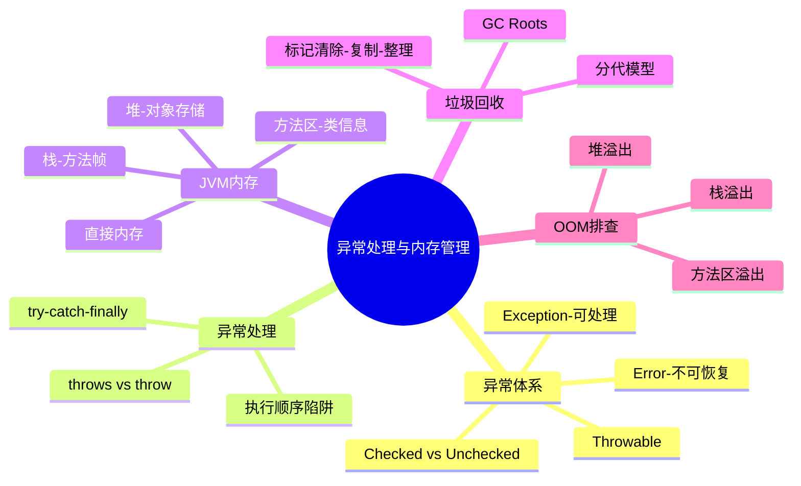

> **本节高频 TOP5**
> 1. Java 异常体系（Checked vs Unchecked）🔥🔥🔥
> 2. JVM 内存区域划分 🔥🔥🔥
> 3. try-catch-finally 执行顺序 🔥🔥
> 4. GC 算法与分代回收 🔥🔥
> 5. OOM 排查思路 🔥🔥

---

## A级题

---

### Q1：介绍一下 Java 异常体系？Checked 和 Unchecked 异常有什么区别？ ⭐⭐ | 🔥🔥🔥 | A级

**考察能力**：[基础知识] + [编码能力]（验证对异常分类的理解以及实际开发中的异常处理策略）

#### 核心区（快速复习）

🟢 **基础提问**："介绍一下 Java 的异常体系？Checked 和 Unchecked 异常有什么区别？"

**必答要点**
- [核心] 顶层是 Throwable，分两支：Error（JVM 级不可恢复，如 OOM/StackOverflow）和 Exception（程序可处理）
- [分类] Exception 分为 Checked（编译时强制处理，如 IOException）和 Unchecked（RuntimeException 及其子类，如 NPE、IndexOutOfBounds）
- [处理] Checked 必须 try-catch 或 throws 声明；Unchecked 不强制但建议处理
- [设计] 自定义业务异常通常继承 RuntimeException（不污染方法签名）

**示例回答**

Java 异常体系以 Throwable 为根，分为 Error 和 Exception。Error 代表严重的 JVM 层面问题，比如 OutOfMemoryError、StackOverflowError，程序不应该也很难捕获恢复。

Exception 又分两类：Checked Exception 是编译期就强制你处理的，比如 IOException、SQLException，不 catch 或 throws 就编译报错。Unchecked Exception 是 RuntimeException 的子类，比如 NullPointerException、ArrayIndexOutOfBoundsException，编译器不强制处理但运行时会抛出。

实际开发中，业务异常一般继承 RuntimeException 做自定义异常，配合全局异常处理器（@ControllerAdvice）统一处理，避免每个方法签名都声明 throws。

**记忆锚点**
> "Throwable分Error和Exception；Checked编译强制，Unchecked运行时抛"
>
> 展开触发词：编译时检查、RuntimeException、业务异常设计

---

#### 深化区（追问准备）

🔴 **追问连环套**
- L1: "为什么不用 throws 声明异常而是在方法内 try-catch？" → 看场景：底层方法 throws 向上传播让调用者决定怎么处理；顶层入口统一 catch 做日志和用户提示。不要在每层都 catch 了又抛出，形成异常吞噬
  - 💡 面试官此时在验证：是否有实际异常处理设计经验
  - L2: "try 里 return 了，finally 还执行吗？如果 finally 也 return 呢？" → finally 一定执行（除非 JVM 退出或线程被杀）。如果 finally 有 return，会覆盖 try 中的返回值。所以**不要在 finally 中 return**
    - 💡 面试官此时在验证：对 finally 语义的精确理解
    - L3: "异常对性能有什么影响？什么时候不该用异常做流程控制？" → 抛异常时 JVM 要填充整个调用栈（fillInStackTrace），成本很高。不应该用异常做正常流程控制（如用 catch 代替 if 判断），高频路径避免异常
      - 💡 面试官此时在验证：性能意识和工程素养

**踩坑提醒**
- ❌ "RuntimeException 不需要处理" → ✅ 不强制但该处理的还是要处理（如参数校验抛 IllegalArgumentException，调用方该防御）
- ❌ "catch(Exception e) 然后什么都不做" → ✅ 至少要日志记录，吞异常是最难排查的 bug 源头

**加分项**
- 了解 JDK 7 的 try-with-resources（实现 AutoCloseable 自动关闭资源）
- 知道 JDK 7 支持 multi-catch：`catch (IOException | SQLException e)`
- 提到 Spring 中 @Transactional 默认只回滚 RuntimeException

**项目结合**
> 场景：线上服务偶尔返回 500 但日志中找不到异常信息
> 排查：发现某处 catch 了 Exception 但只打了 warn 级别日志且没有堆栈
> 方案：统一规范——catch 必须带堆栈（`log.error("msg", e)`），全局异常处理兜底
> 效果：异常排查时间从平均 2 小时降到 15 分钟
> ⚠️ 面试官会追问：全局异常处理怎么区分业务异常和系统异常？

---

### Q2：JVM 内存区域是怎么划分的？各区域存什么？ ⭐⭐ | 🔥🔥🔥 | A级

**考察能力**：[基础知识] + [问题定位]（验证对 JVM 运行时数据区的理解，是 OOM 排查和调优的前置知识）

#### 核心区（快速复习）

🟢 **基础提问**："JVM 内存区域是怎么划分的？每个区域存什么内容？"

**必答要点**
- [核心] 线程私有：程序计数器（当前指令地址）、虚拟机栈（方法调用栈帧，含局部变量表/操作数栈）、本地方法栈（Native 方法）
- [核心] 线程共享：堆（对象实例、数组）、方法区/元空间（类信息、常量池、静态变量）
- [补充] 直接内存（NIO 的 DirectByteBuffer，不受 GC 直接管理）
- [版本] JDK 8 移除永久代（PermGen），用 Metaspace（本地内存）替代

**示例回答**

JVM 运行时数据区分为线程私有和线程共享两大块。

线程私有的有三个：程序计数器记录当前线程执行到哪条字节码指令，不会 OOM；虚拟机栈每个方法调用创建一个栈帧，存局部变量表、操作数栈、动态链接等，递归过深会 StackOverflowError；本地方法栈服务于 Native 方法。

线程共享的有两个：堆是最大的一块，存所有对象实例和数组，是 GC 的主战场，分为新生代（Eden + S0 + S1）和老年代。方法区（JDK 8 后叫 Metaspace）存类的元信息、运行时常量池、静态变量，使用本地内存而非 JVM 堆内存。

另外还有直接内存，NIO 的 DirectByteBuffer 分配的内存，不在堆内，不受 -Xmx 限制但受物理内存限制。

**记忆锚点**
> "私有三区：计数器-虚拟机栈-本地方法栈；共享两区：堆放对象-元空间放类"
>
> 展开触发词：栈帧结构、新生代老年代、PermGen→Metaspace

---

#### 深化区（追问准备）

🔴 **追问连环套**
- L1: "堆内存怎么分代的？为什么要分代？" → 新生代（Eden:S0:S1 = 8:1:1）和老年代。分代假说：大部分对象朝生夕灭，新生代用复制算法（快），老年代对象存活久用标记整理（省空间）
  - 💡 面试官此时在验证：是否理解分代的设计动机
  - L2: "哪些情况对象会直接进入老年代？" → 大对象（超过 `-XX:PretenureSizeThreshold`）、长期存活对象（年龄超过阈值，默认15）、Survivor 放不下的对象、动态年龄判断超过 50%
    - 💡 面试官此时在验证：对晋升机制的具体了解
    - L3: "Metaspace 会 OOM 吗？什么场景？" → 会。大量动态生成类（CGLib/反射/JSP）导致 Metaspace 耗尽。可通过 `-XX:MaxMetaspaceSize` 限制上界
      - 💡 面试官此时在验证：能否将内存模型与实际故障关联

**踩坑提醒**
- ❌ "JDK 8 还有永久代" → ✅ JDK 8 用 Metaspace 替代了永久代，存储在本地内存中
- ❌ "程序计数器会 OOM" → ✅ 程序计数器是唯一不会 OOM 的区域

**加分项**
- 了解 TLAB（Thread Local Allocation Buffer）——每个线程在 Eden 中私有的分配区，减少锁竞争
- 知道 JDK 9+ 默认 G1 收集器，堆被划分为 Region 而非物理上的连续新生代/老年代

**项目结合**
> 场景：服务频繁 Full GC，接口 P99 飙升
> 排查：jstat -gcutil 观察到老年代占满，jmap -histo 发现大量缓存对象未过期
> 方案：缓存加 TTL + 弱引用（WeakHashMap）兜底，调大新生代比例减少过早晋升
> 效果：Full GC 从每小时 5 次降到每天不到 1 次
> ⚠️ 面试官会追问：你怎么确定是缓存的问题不是内存泄漏？用了什么工具分析？

---

## B级题

---

### Q3：try-catch-finally 的执行顺序？finally 里 return 会怎样？ ⭐⭐ | 🔥🔥 | B级

**考察能力**：[基础知识] + [编码能力]（验证对异常控制流的精确理解）

🟢 **基础提问**："try 里有 return，finally 还会执行吗？try{return 'a'} finally{return 'b'} 返回什么？"

**必答要点**
- [核心] finally 块几乎一定会执行（除非 `System.exit()` 或线程被杀死）
- [执行顺序] try 中 return 语句先计算返回值 → 执行 finally → 再真正返回
- [陷阱] finally 中 return 会覆盖 try/catch 中的返回值，结果是 "b"
- [规范] 不要在 finally 中 return 或抛出异常，会掩盖原始结果/异常

**示例回答**

finally 一定会执行，即使 try 里有 return。执行顺序是：try 中 return 表达式先求值并暂存，然后执行 finally 块，最后返回暂存的值。

但如果 finally 里也有 return，它会直接覆盖 try 的返回值。所以 `try{return "a"} finally{return "b"}` 返回的是 "b"。这也是为什么编码规范禁止在 finally 中 return——它会吞掉 catch 中的异常，造成 bug 难以定位。

🔴 **追问连环套**
- L1: "try 里修改了引用类型的值，finally 里能看到吗？" → 能看到。try return 暂存的是引用的副本，但引用指向的对象如果在 finally 中被修改，返回的对象内容也变了（基本类型不受影响，暂存的是值副本）
  - 💡 面试官此时在验证：对值传递和引用类型的交叉理解
  - L2: "try-with-resources 和 finally 有什么关系？" → try-with-resources 编译后会生成 finally 来调用 close()，且能正确处理 close 本身抛出的异常（addSuppressed）。比手写 finally 更安全

**踩坑提醒**
- ❌ "finally 不执行的情况很多" → ✅ 只有 System.exit()、JVM 崩溃、死循环/死锁阻塞在 try 中三种极端情况

**记忆锚点**
> "try先算暂存→finally执行→返回暂存值；finally有return则覆盖"

---

### Q4：GC 算法有哪些？分代回收怎么工作的？ ⭐⭐ | 🔥🔥 | B级

**考察能力**：[基础知识] + [问题定位]（验证对垃圾回收机制的理解，是调优的基础）

🟢 **基础提问**："常见的 GC 算法有哪些？分代回收是怎么回事？"

**必答要点**
- [核心] 三大基础算法：标记-清除（碎片多）、复制算法（空间换时间，适合新生代）、标记-整理（老年代，无碎片但慢）
- [分代] 新生代用复制算法（Eden + 2 Survivor，每次只用一个 S 区），老年代用标记-整理
- [判活] 可达性分析——从 GC Roots 出发不可达的对象判定为垃圾
- [GC Roots] 虚拟机栈中的引用、静态变量、常量、JNI 引用

**示例回答**

GC 先要判断哪些对象是垃圾。Java 用可达性分析：从 GC Roots（栈中引用、静态变量、常量池引用等）出发，遍历引用链，不可达的对象就是垃圾。

回收算法有三种基础方案：标记-清除——标记所有垃圾然后清除，简单但会产生内存碎片。复制算法——把存活对象复制到另一块空间，然后整块清除，快但浪费一半空间。标记-整理——标记后把存活对象向一端压缩，消除碎片但需要移动对象。

分代回收结合了各自优势：新生代对象"朝生夕灭"，用复制算法（只有少量存活需要复制，效率高）。老年代对象存活率高，用标记-整理。每次 Minor GC 只扫描新生代，速度快；Full GC 扫描全堆，耗时长。

🔴 **追问连环套**
- L1: "Minor GC、Major GC、Full GC 的区别？" → Minor GC 只回收新生代；Major GC 回收老年代（概念模糊，有些文档等同 Full GC）；Full GC 回收整个堆 + 方法区，触发条件包括老年代满、Metaspace 满、System.gc()
  - 💡 面试官此时在验证：对 GC 事件的精确认知
  - L2: "了解 G1/ZGC 吗？跟 CMS 有什么区别？" → G1 把堆划分为大小相等的 Region，可预测停顿时间（-XX:MaxGCPauseMillis）；ZGC 几乎全并发，停顿 < 10ms（JDK 15+生产可用）。CMS 用标记-清除有碎片，JDK 14 已移除

**踩坑提醒**
- ❌ "引用计数法是 Java 的 GC 策略" → ✅ Java 不用引用计数（有循环引用问题），用可达性分析。Python/Swift 用引用计数

**记忆锚点**
> "标记清除有碎片，复制快费空间，标记整理无碎片慢；新生代复制，老年代整理"

---

### Q5：什么是 OOM？常见的 OOM 场景和排查思路？ ⭐⭐ | 🔥🔥 | B级

**考察能力**：[问题定位] + [基础知识]（验证实际排查 OOM 的能力）

🟢 **基础提问**："什么情况会出现 OOM？遇到了怎么排查？"

**必答要点**
- [堆溢出] `java.lang.OutOfMemoryError: Java heap space`——对象过多或内存泄漏
- [栈溢出] `StackOverflowError`——递归过深或方法调用链过长
- [元空间] `Metaspace`——动态生成类过多（CGLib、大量 JSP）
- [排查] 配置 `-XX:+HeapDumpOnOutOfMemoryError`，用 MAT/VisualVM 分析 dump

**示例回答**

OOM 是 JVM 内存不够用时抛出的错误。常见几种：

堆内存溢出最常见——不断创建对象且无法 GC 回收（内存泄漏），或一次性加载过大数据。排查：先看 GC 日志确认是否频繁 Full GC 后仍然满，然后分析 heap dump（MAT 找支配树中占内存最大的对象链路）。

栈溢出一般是递归没有终止条件或调用层次过深。直接看堆栈就能定位。

Metaspace 溢出通常是动态代理/反射生成了太多类。排查：jmap 或 arthas 查看已加载类数量。

排查五步法：看日志确认 OOM 类型 → dump 文件 → MAT 分析大对象 → 定位代码 → 验证修复。

🔴 **追问连环套**
- L1: "内存泄漏和内存溢出的区别？" → 泄漏是对象不再使用但仍被引用导致 GC 无法回收（最终导致溢出）；溢出是内存确实不够用。泄漏是因，溢出是果
  - 💡 面试官此时在验证：概念区分是否清晰
  - L2: "常见的内存泄漏场景有哪些？" → 静态集合持有大对象、未关闭的连接/流、ThreadLocal 未 remove、内部类隐式持有外部类引用、监听器/回调未注销

**踩坑提醒**
- ❌ "OOM 就是堆不够大，加内存就行" → ✅ 先确认是内存泄漏还是确实需要更多内存。盲目加内存只是延迟问题爆发

**记忆锚点**
> "看→dump→查→改→验（OOM排查五步）；泄漏是因溢出是果"

---

## C级题

---

### Q6：throw 和 throws 的区别？ ⭐ | 🔥 | C级

**考察能力**：[基础知识]

🟢 **基础提问**："throw 和 throws 有什么区别？"

**核心回答**

`throw` 是在方法体内手动抛出一个异常对象（`throw new RuntimeException("msg")`），执行到这里就立即中断。`throws` 是在方法签名上声明该方法可能抛出的异常类型（`void read() throws IOException`），告知调用者需要处理。throw 是动作，throws 是声明。

**记忆锚点**
> "throw方法内抛对象，throws签名上声明类型"

---

### Q7：对象什么时候会被回收？ ⭐ | 🔥 | C级

**考察能力**：[基础知识]

🟢 **基础提问**："new 出的对象什么时候被回收？"

**核心回答**

对象被回收需要满足：从 GC Roots 出发不可达（没有任何引用链指向它）。GC 触发时机由 JVM 决定（Eden 满触发 Minor GC，老年代满触发 Full GC）。另外对象有 finalize() 方法时会有一次"缓刑"机会——第一次不可达时放入 F-Queue，如果在 finalize 中重新建立引用可以自救（但只有一次机会，不推荐使用）。

**记忆锚点**
> "GC Roots不可达即可回收，finalize自救仅一次不推荐"

---

### Q8：类加载机制了解吗？什么是双亲委派？ ⭐⭐ | 🔥 | C级

**考察能力**：[基础知识]

🟢 **基础提问**："简单说说类加载机制和双亲委派模型？"

**核心回答**

类加载过程：加载 → 验证 → 准备 → 解析 → 初始化。加载器有三层：Bootstrap（核心类库 rt.jar）、Extension（ext 目录）、Application（classpath）。

双亲委派：收到加载请求先委托给父加载器，父加载器找不到再自己加载。好处是防止核心类被篡改（如自定义 java.lang.String 不会被加载）。打破双亲委派的场景：SPI（JDBC 的 DriverManager）、OSGi、Tomcat（每个 webapp 独立 ClassLoader）。

**记忆锚点**
> "加验准解初五步；先问父再自己加载；SPI/Tomcat打破委派"

---

## 锚点速查汇总

| # | 题目 | 锚点 | 展开触发词 |
|---|------|------|-----------|
| Q1 | Java异常体系 | Throwable分Error和Exception；Checked编译强制，Unchecked运行时抛 | RuntimeException、业务异常、全局处理 |
| Q2 | JVM内存区域 | 私有三区：计数器-虚拟机栈-本地方法栈；共享两区：堆放对象-元空间放类 | 栈帧、分代、Metaspace |
| Q3 | try-catch-finally | try先算暂存→finally执行→返回暂存值；finally有return则覆盖 | 执行顺序、try-with-resources、addSuppressed |
| Q4 | GC算法 | 标记清除有碎片，复制快费空间，标记整理无碎片慢；新生代复制，老年代整理 | 可达性分析、GC Roots、分代假说 |
| Q5 | OOM排查 | 看→dump→查→改→验；泄漏是因溢出是果 | heap dump、MAT、常见泄漏场景 |
| Q6 | throw vs throws | throw方法内抛对象，throws签名上声明类型 | 动作vs声明、异常传播 |
| Q7 | 对象回收 | GC Roots不可达即可回收，finalize自救仅一次不推荐 | 引用链、GC触发时机 |
| Q8 | 类加载 | 加验准解初五步；先问父再自己加载；SPI/Tomcat打破委派 | Bootstrap、双亲委派、安全性 |
