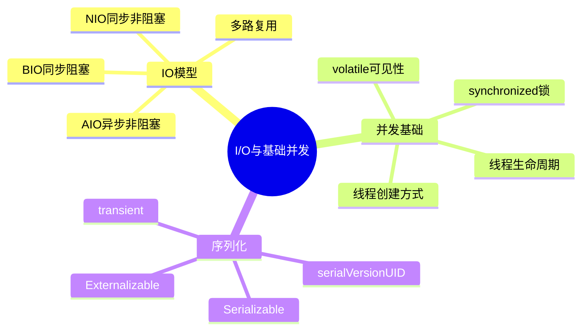

## 🎯 TOP 5 高频题

| 序号 | 题目 | 热度 |
|------|------|------|
| 1 | BIO、NIO、AIO 的区别 | 🔥🔥🔥 |
| 2 | volatile 关键字的作用和原理 | 🔥🔥🔥 |
| 3 | synchronized 的使用方式和锁升级 | 🔥🔥🔥 |
| 4 | NIO 的三大核心组件 | 🔥🔥 |
| 5 | 线程的创建方式和生命周期 | 🔥🔥 |

---

## A级题 🔥🔥🔥

---

### Q1：BIO、NIO、AIO 分别是什么？有什么区别？

#### 📌 核心区

| 模型 | 全称 | 特点 | 适用场景 |
|------|------|------|----------|
| BIO | Blocking I/O | 同步阻塞，一连接一线程 | 连接数少且固定的场景 |
| NIO | Non-blocking I/O | 同步非阻塞，多路复用 | 连接数多、短连接（聊天室、弹幕） |
| AIO | Asynchronous I/O | 异步非阻塞，回调通知 | 连接数多且操作重（大文件传输） |

**BIO 模型：**
- 服务端为每个客户端连接创建一个线程
- 线程在 `read()` / `accept()` 时阻塞等待
- 问题：连接数增多时线程爆炸，资源浪费严重

**NIO 模型：**
- 引入 Channel + Buffer + Selector 三大组件
- 一个线程通过 Selector 管理多个 Channel
- 基于事件驱动，非阻塞轮询就绪事件

**AIO 模型：**
- 真正的异步，操作系统完成 I/O 后回调通知应用
- Java 中通过 `AsynchronousSocketChannel` 实现
- Linux 上 AIO 支持不够成熟，Netty 仍选择 NIO

#### 🔁 深化区（追问连环套）

**第一层：NIO 的多路复用是怎么实现的？**

Selector 底层依赖操作系统的 I/O 多路复用机制：

| 系统 | 实现 | 特点 |
|------|------|------|
| Linux | epoll | 红黑树 + 就绪链表，O(1) 事件通知 |
| macOS | kqueue | 类似 epoll，BSD 系统专用 |
| Windows | IOCP | 真正的异步 I/O 完成端口 |

epoll 相对 select/poll 的优势：
1. 没有最大连接数限制（select 默认 1024）
2. 不需要每次把 fd 集合从用户态拷贝到内核态
3. 通过回调通知就绪事件，不需要遍历所有 fd

**第二层：为什么 Netty 不使用 AIO 而用 NIO？**

1. **Linux AIO 不成熟**：Linux 的 AIO 实现限制多，不如 epoll 稳定高效
2. **Netty 自身优化足够**：Netty 在 NIO 基础上做了大量优化（零拷贝、内存池、EventLoop）
3. **编程模型统一**：NIO 模型在所有平台表现一致，AIO 在不同 OS 上行为差异大
4. **实测性能差距小**：在大多数场景下，优化过的 NIO 性能不逊于 AIO

**第三层：零拷贝在 NIO 中怎么体现？**

传统 I/O 需要 4 次拷贝：磁盘 → 内核缓冲区 → 用户缓冲区 → Socket 缓冲区 → 网卡。

NIO 零拷贝方案：
- **`mmap`**：将内核缓冲区映射到用户空间，减少一次拷贝（3次）
- **`sendfile`**：数据不经过用户态，内核直接传输（2次，Linux 2.4+ 可 DMA gather 实现真正 0 次 CPU 拷贝）
- **Java 实现**：`FileChannel.transferTo()` / `MappedByteBuffer`

> 📎 **记忆锚点**：「BIO 一对一排队 → NIO 一对多叫号 → AIO 外卖送达」
> - 展开触发词：餐厅模型、Selector 叫号机制、回调通知

---

### Q2：volatile 关键字的作用是什么？底层怎么实现的？

#### 📌 核心区

volatile 提供两个语义保证：

| 语义 | 说明 | 解决的问题 |
|------|------|-----------|
| 可见性 | 一个线程修改后，其他线程立即可见 | 工作内存与主内存不一致 |
| 有序性 | 禁止指令重排序 | 编译器/CPU 优化导致执行顺序错乱 |

**注意：volatile 不保证原子性！** `i++` 在 volatile 变量上仍然不安全。

**底层实现 — 内存屏障（Memory Barrier）：**

```java
// 写操作前插入 StoreStore 屏障
// 写操作后插入 StoreLoad 屏障
volatile boolean flag = true;

// 读操作前插入 LoadLoad 屏障
// 读操作后插入 LoadStore 屏障
if (flag) { ... }
```

在 x86 架构上，volatile 写会生成 `lock` 前缀指令：
1. 将当前处理器缓存行写回主内存
2. 触发缓存一致性协议（MESI），使其他 CPU 缓存中该地址的数据失效

#### 🔁 深化区（追问连环套）

**第一层：volatile 的典型使用场景？**

1. **状态标志位**：线程间通信的开关变量
```java
volatile boolean running = true;
// 线程A：running = false;
// 线程B：while(running) { ... }
```

2. **DCL 单例的 instance**：防止半初始化对象逸出
```java
private volatile static Singleton instance;
```

3. **CAS 操作的底层变量**：`AtomicInteger` 内部的 `value` 字段

**第二层：为什么 DCL 单例必须加 volatile？**

对象创建 `new Singleton()` 实际分三步：
1. 分配内存空间
2. 初始化对象
3. 将引用指向内存地址

没有 volatile 时，步骤 2 和 3 可能重排序：
- 线程 A 执行到步骤 3（引用已非 null）但未执行步骤 2
- 线程 B 判断 `instance != null`，直接返回未初始化的对象
- volatile 禁止重排序，确保对象完全初始化后引用才可见

**第三层：volatile 和 synchronized 怎么选？**

| 维度 | volatile | synchronized |
|------|----------|--------------|
| 原子性 | ❌ 不保证 | ✅ 保证 |
| 可见性 | ✅ | ✅ |
| 有序性 | ✅ | ✅ |
| 阻塞 | ❌ 非阻塞 | ✅ 可能阻塞 |
| 适用 | 一写多读、状态标志 | 复合操作、临界区 |
| 性能 | 低开销 | 较高开销（锁竞争时） |

原则：能用 volatile 解决的就不用 synchronized，需要原子性时必须用锁或 Atomic 类。

> 📎 **记忆锚点**：「volatile = 可见 + 有序 − 原子」
> - 展开触发词：内存屏障、MESI 协议、DCL 半初始化

---

### Q3：synchronized 的使用方式和锁升级过程？

#### 📌 核心区

**三种使用方式：**

| 用法 | 锁对象 | 示例 |
|------|--------|------|
| 修饰实例方法 | 当前实例 this | `synchronized void method()` |
| 修饰静态方法 | 当前类的 Class 对象 | `static synchronized void method()` |
| 修饰代码块 | 括号内指定的对象 | `synchronized(obj) { ... }` |

**底层实现：**
- 代码块：通过 `monitorenter` / `monitorexit` 字节码指令
- 方法：通过方法标志位 `ACC_SYNCHRONIZED`
- 本质都是获取对象的 Monitor（管程）

**锁升级过程（JDK 6+）：**

```
无锁 → 偏向锁 → 轻量级锁 → 重量级锁
```

| 锁状态 | 适用场景 | 实现方式 | 性能 |
|--------|----------|----------|------|
| 偏向锁 | 只有一个线程访问 | Mark Word 记录线程 ID | 几乎无开销 |
| 轻量级锁 | 两个线程交替访问 | CAS 修改 Mark Word | 自旋消耗 CPU |
| 重量级锁 | 多线程竞争激烈 | Monitor，线程阻塞挂起 | 开销最大 |

#### 🔁 深化区（追问连环套）

**第一层：Mark Word 中锁状态怎么存储的？**

64 位 JVM 中对象头 Mark Word（8 字节）结构：

| 锁状态 | 标志位 | 存储内容 |
|--------|--------|----------|
| 无锁 | 001 | hashCode、GC 年龄 |
| 偏向锁 | 101 | 线程 ID、epoch、GC 年龄 |
| 轻量级锁 | 00 | 指向栈中锁记录的指针 |
| 重量级锁 | 10 | 指向 Monitor 的指针 |
| GC 标记 | 11 | 空 |

偏向锁撤销时机：
- 其他线程尝试获取该锁
- 调用了对象的 `hashCode()`（因为偏向锁状态下 Mark Word 没有空间存 hashCode）

**第二层：synchronized 和 ReentrantLock 的区别？**

| 维度 | synchronized | ReentrantLock |
|------|-------------|---------------|
| 实现 | JVM 内置 | JDK API（AQS） |
| 释放 | 自动释放 | 手动 unlock（finally 中） |
| 中断 | 不可中断 | 可中断 lockInterruptibly |
| 公平性 | 非公平 | 可选公平/非公平 |
| 条件 | 单一 wait/notify | 多个 Condition |
| 性能 | JDK 6 后优化接近 | 略优（高竞争场景） |

选择建议：简单同步用 synchronized，需要高级功能（超时、中断、多条件队列）用 ReentrantLock。

**第三层：什么是锁消除和锁粗化？**

**锁消除**（Lock Elimination）：
- JIT 编译器通过逃逸分析，发现锁对象不会被其他线程访问
- 直接消除同步操作
- 例：方法内 new 的 StringBuffer，不会逸出，同步操作可消除

**锁粗化**（Lock Coarsening）：
- 连续多次对同一个对象加锁/解锁（如循环中）
- JIT 将多次同步合并为一次更大范围的同步
- 减少锁操作的开销

```java
// 优化前：每次循环都加锁解锁
for (int i = 0; i < 100; i++) {
    synchronized(lock) { list.add(i); }
}
// 优化后：一次性加锁
synchronized(lock) {
    for (int i = 0; i < 100; i++) { list.add(i); }
}
```

> 📎 **记忆锚点**：「偏向→轻量→重量 = VIP→排队→叫保安」
> - 展开触发词：Mark Word 标志位、CAS 自旋、Monitor 阻塞

---

## B级题 🔥🔥

---

### Q4：NIO 的三大核心组件是什么？

#### 📌 基础提问

| 组件 | 作用 | 类比 |
|------|------|------|
| Channel | 双向数据通道 | 铁路轨道 |
| Buffer | 数据缓冲区 | 火车车厢 |
| Selector | 多路复用器 | 调度中心 |

**Channel**：类似流但双向，主要实现：
- `FileChannel`：文件读写
- `SocketChannel`：TCP 客户端
- `ServerSocketChannel`：TCP 服务端
- `DatagramChannel`：UDP

**Buffer**：本质是一块可以读写的内存区域，核心属性：
- `capacity`：总容量
- `position`：当前读写位置
- `limit`：读写上限
- `flip()`：写模式切换到读模式

**Selector**：
- 一个线程管理多个 Channel
- `select()` 阻塞等待就绪事件
- 就绪事件类型：`OP_ACCEPT`、`OP_CONNECT`、`OP_READ`、`OP_WRITE`

#### 🔁 追问

**第一层：Buffer 的 flip() 做了什么？**

```java
buffer.put(data);    // 写入数据后：position=N, limit=capacity
buffer.flip();       // 切换为读模式：limit=position, position=0
buffer.get();        // 从 0 开始读取到 limit
buffer.clear();      // 重置：position=0, limit=capacity
```

`flip()` 将 limit 设为当前 position，然后 position 归零，这样后续读操作只读到已写入的数据。

**第二层：DirectByteBuffer 和 HeapByteBuffer 的区别？**

| 类型 | 内存位置 | GC 影响 | I/O 性能 | 分配速度 |
|------|----------|---------|----------|----------|
| HeapByteBuffer | JVM 堆 | 受 GC 管理 | 需额外拷贝 | 快 |
| DirectByteBuffer | 堆外内存 | 不受 GC 直接管理 | 零拷贝 | 慢 |

DirectByteBuffer 适用于长生命周期、频繁 I/O 的场景（如 Netty 的 ByteBuf）。

> 📎 **记忆锚点**：「Channel 是路、Buffer 是车、Selector 是调度台」
> - 展开触发词：flip 切换读写模式、epoll 多路复用

---

### Q5：Java 中创建线程有几种方式？线程的生命周期？

#### 📌 基础提问

**创建线程的方式：**

| 方式 | 特点 |
|------|------|
| 继承 Thread | 简单，但单继承限制 |
| 实现 Runnable | 解耦任务和线程，推荐 |
| 实现 Callable + FutureTask | 有返回值，可抛异常 |
| 线程池 ExecutorService | 复用线程，生产环境推荐 |

**线程生命周期（6 种状态）：**

```
NEW → RUNNABLE → (BLOCKED / WAITING / TIMED_WAITING) → TERMINATED
```

| 状态 | 触发条件 |
|------|----------|
| NEW | new Thread() 但未 start |
| RUNNABLE | 调用 start()，包含 Ready 和 Running |
| BLOCKED | 等待获取 synchronized 锁 |
| WAITING | wait()、join()、LockSupport.park() |
| TIMED_WAITING | sleep(n)、wait(n)、join(n) |
| TERMINATED | run() 执行完毕或异常退出 |

#### 🔁 追问

**第一层：start() 和 run() 的区别？**

- `start()`：创建新线程，新线程执行 run() 方法
- `run()`：普通方法调用，在当前线程执行，不会启动新线程

```java
Thread t = new Thread(() -> System.out.println(Thread.currentThread().getName()));
t.start();  // 输出：Thread-0
t.run();    // 输出：main
```

**第二层：为什么不推荐直接用 Thread 或 Runnable 创建线程？**

生产环境推荐线程池的原因：
1. **减少创建销毁开销**：线程创建涉及 OS 内核调用
2. **控制并发数**：避免线程爆炸导致 OOM
3. **统一管理**：便于监控、超时控制、异常处理
4. **任务队列缓冲**：削峰填谷

> 📎 **记忆锚点**：「Thread 6 态 = 新生→就绪运行→阻塞等待→死亡」
> - 展开触发词：start vs run、线程池复用、状态转换图

---

### Q6：Java 序列化是什么？serialVersionUID 的作用？

#### 📌 基础提问

序列化是将对象转换为字节流的过程，反序列化则相反。

**实现方式：**

| 方式 | 特点 |
|------|------|
| Serializable | 标记接口，JDK 自带，性能一般 |
| Externalizable | 自定义序列化逻辑，需实现 readExternal/writeExternal |
| JSON/Protobuf | 跨语言，生产环境常用 |

**关键字段和关键字：**

- **`serialVersionUID`**：序列化版本号，反序列化时校验版本一致性
  - 不显式声明时 JVM 根据类结构自动生成
  - 类结构变化会导致自动生成的 UID 变化 → `InvalidClassException`
  - 建议显式声明并在兼容修改时保持不变

- **`transient`**：标记字段不参与序列化
  - 敏感信息（密码）、可重新计算的字段、不可序列化的引用

#### 🔁 追问

**第一层：为什么不推荐 Java 原生序列化？**

1. **安全漏洞**：反序列化攻击（利用 gadget chain 执行任意代码）
2. **性能差**：序列化结果大，速度慢
3. **不跨语言**：只能 Java 之间使用
4. 替代方案：JSON（Jackson/Gson）、Protobuf、Kryo、Hessian

**第二层：static 字段会被序列化吗？**

不会。static 字段属于类而非实例，序列化是针对对象状态的。反序列化后 static 字段的值来自当前 JVM 中该类的值，而不是序列化流中的值。

> 📎 **记忆锚点**：「serialVersionUID = 对象的身份证号，改了就不认识了」
> - 展开触发词：transient 排除字段、反序列化攻击

---

## C级题 🔥

---

### Q7：高并发场景下 Java 网络 I/O 方案怎么选？

高并发网络 I/O 选型策略：

| 连接数 | 推荐方案 | 理由 |
|--------|----------|------|
| < 1000 | BIO + 线程池 | 简单可靠，够用 |
| 1000 ~ 10万 | NIO（Netty） | 多路复用，线程利用率高 |
| > 10万 | Netty + 多 EventLoop | 业界标准，久经考验 |

生产环境几乎不直接使用 JDK 原生 NIO，而是选择 Netty 框架：
- 封装了 NIO 的复杂性（Buffer 管理、半包/粘包处理）
- 提供了丰富的编解码器
- 内存池 + 零拷贝优化

> 📎 **记忆锚点**：「千以下 BIO 够用 → 万级 NIO → 十万 Netty」

---

### Q8：什么是 Native 方法？JNI 的作用？

**Native 方法**：使用 `native` 关键字声明，方法体由 C/C++ 实现。

```java
public native int hashCode(); // Object 类中的典型 native 方法
```

**JNI（Java Native Interface）：**
- Java 调用本地代码（C/C++）的桥梁
- 使用场景：
  - 调用系统底层功能（文件操作、网络）
  - 复用已有的 C/C++ 库
  - 性能敏感的计算密集型操作
- 代价：丧失跨平台性、增加调试难度、可能引入内存问题

> 📎 **记忆锚点**：「native = Java 和 C 之间的翻译官」

---

### Q9：Java 进程和操作系统是什么关系？

- JVM 本身是一个操作系统进程
- Java 线程映射为 OS 原生线程（1:1 模型，HotSpot）
- JVM 内存是进程虚拟地址空间的一部分
- GC 的 STW 会暂停进程中所有 Java 线程
- 文件 I/O、网络 I/O 最终都通过系统调用完成

**Java 21 虚拟线程（预览）：**
- 虚拟线程是 JVM 调度的轻量线程（M:N 模型）
- 不再 1:1 绑定 OS 线程，一个 OS 线程可承载大量虚拟线程
- 适合 I/O 密集型高并发场景

> 📎 **记忆锚点**：「JVM = 一个 OS 进程，Java 线程 = OS 线程」

---

## 📋 锚点速查汇总

| 题号 | 锚点 | 触发词 |
|------|------|--------|
| Q1 | BIO 排队 → NIO 叫号 → AIO 外卖 | 餐厅模型、Selector、回调 |
| Q2 | volatile = 可见+有序−原子 | 内存屏障、MESI、DCL |
| Q3 | 偏向→轻量→重量 = VIP→排队→叫保安 | Mark Word、CAS、Monitor |
| Q4 | Channel 路、Buffer 车、Selector 调度台 | flip、epoll |
| Q5 | Thread 6 态 = 新→就绪运行→阻塞等待→死 | start/run、线程池 |
| Q6 | serialVersionUID = 身份证号 | transient、反序列化攻击 |
| Q7 | 千 BIO → 万 NIO → 十万 Netty | 连接数选型 |
| Q8 | native = 翻译官 | JNI、系统调用 |
| Q9 | JVM = OS 进程 | 1:1 线程模型、虚拟线程 |
