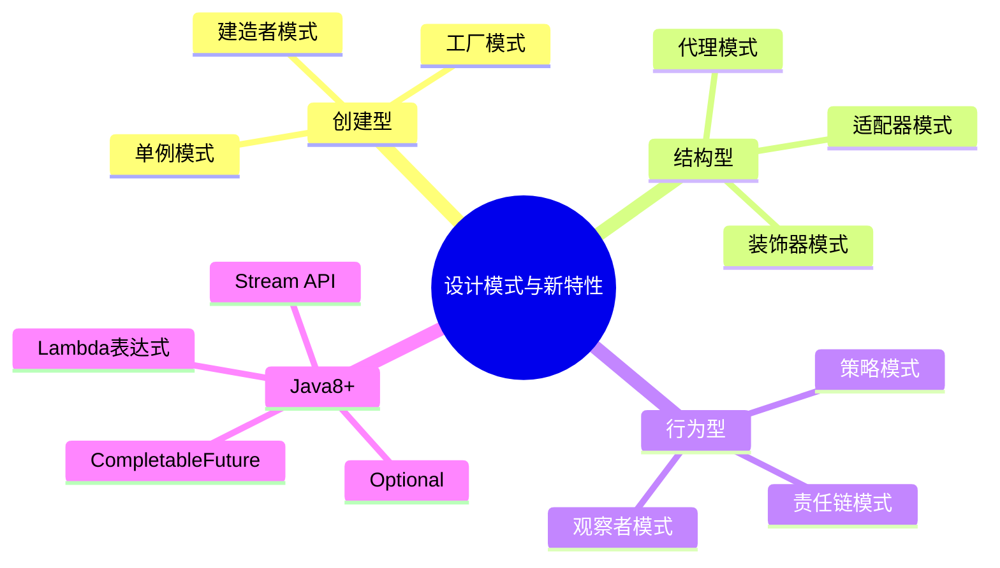

## 🎯 TOP 5 高频题

| 序号 | 题目 | 热度 |
|------|------|------|
| 1 | 单例模式的实现方式与线程安全 | 🔥🔥🔥 |
| 2 | Java 8 新特性有哪些 | 🔥🔥🔥 |
| 3 | 代理模式（静态代理 vs 动态代理） | 🔥🔥 |
| 4 | 策略模式和责任链模式 | 🔥🔥 |
| 5 | Stream API 和 CompletableFuture | 🔥🔥 |

---

## A级题 🔥🔥🔥

---

### Q1：单例模式有哪些实现方式？怎么保证线程安全？

#### 📌 核心区

| 实现方式 | 线程安全 | 懒加载 | 防反射 | 防序列化 |
|----------|----------|--------|--------|----------|
| 饿汉式 | ✅ | ❌ | ❌ | ❌ |
| DCL（双重检查锁） | ✅ | ✅ | ❌ | ❌ |
| 静态内部类 | ✅ | ✅ | ❌ | ❌ |
| 枚举 | ✅ | ❌ | ✅ | ✅ |

**饿汉式：**
```java
public class Singleton {
    private static final Singleton INSTANCE = new Singleton();
    private Singleton() {}
    public static Singleton getInstance() { return INSTANCE; }
}
```

**DCL（最常考）：**
```java
public class Singleton {
    private volatile static Singleton instance; // volatile 防止指令重排
    private Singleton() {}
    public static Singleton getInstance() {
        if (instance == null) {              // 第一次检查，避免不必要的同步
            synchronized (Singleton.class) {
                if (instance == null) {      // 第二次检查，防止重复创建
                    instance = new Singleton();
                }
            }
        }
        return instance;
    }
}
```

**枚举（Effective Java 推荐）：**
```java
public enum Singleton {
    INSTANCE;
    public void doSomething() { ... }
}
```

#### 🔁 深化区（追问连环套）

**第一层：DCL 中 volatile 为什么不能去掉？**

`new Singleton()` 在字节码层面分三步：
1. 分配内存空间（`allocate`）
2. 初始化对象（`init`）
3. 将引用指向内存地址（`astore`）

CPU/编译器可能将步骤 2 和 3 重排序为 1→3→2：
- 线程 A 执行到步骤 3，instance 已非 null 但对象未初始化
- 线程 B 进入第一层 if 检查，发现 instance != null，直接返回半初始化对象
- volatile 通过内存屏障禁止 2 和 3 重排序

**第二层：怎么防止反射破坏单例？**

反射可以通过 `setAccessible(true)` 调用私有构造器：
```java
Constructor<?> c = Singleton.class.getDeclaredConstructor();
c.setAccessible(true);
Singleton s2 = (Singleton) c.newInstance(); // 新对象！
```

防御手段：
1. **构造器中检查**：如果 INSTANCE 已存在就抛异常
2. **枚举方式**：JVM 层面保证枚举不可被反射创建（`newInstance()` 会抛异常）

**第三层：Spring 中的单例 Bean 是怎么实现的？**

Spring 的单例 ≠ 设计模式的单例：
- 设计模式单例：一个 ClassLoader 中只有一个实例
- Spring 单例：一个 IoC 容器中只有一个实例（`scope=singleton`）

实现方式：
1. 使用 `ConcurrentHashMap` 作为单例缓存池（`singletonObjects`）
2. 三级缓存解决循环依赖
3. `getSingleton()` 中先查缓存，没有再通过 `createBean()` 创建并放入缓存

> 📎 **记忆锚点**：「DCL = 双重 if + synchronized + volatile 三件套」
> - 展开触发词：指令重排、半初始化、枚举最安全

---

### Q2：Java 8 有哪些重要的新特性？

#### 📌 核心区

| 特性 | 作用 | 典型使用 |
|------|------|----------|
| Lambda 表达式 | 简化匿名内部类 | `list.forEach(x -> ...)` |
| Stream API | 集合声明式处理 | filter/map/reduce |
| Optional | 优雅处理 null | 避免 NPE |
| 函数式接口 | 支持 Lambda | Predicate/Function/Consumer |
| 接口默认方法 | 接口可有实现 | `default void method()` |
| 新日期 API | 替代 Date/Calendar | LocalDate/LocalDateTime |
| CompletableFuture | 异步编程 | 链式异步任务编排 |
| 方法引用 | 简化 Lambda | `String::valueOf` |

**Lambda 表达式：**
```java
// 传统写法
Comparator<String> c = new Comparator<String>() {
    public int compare(String a, String b) { return a.length() - b.length(); }
};
// Lambda
Comparator<String> c = (a, b) -> a.length() - b.length();
```

**Stream API 核心操作：**
```java
List<String> result = list.stream()
    .filter(s -> s.length() > 3)      // 中间操作：过滤
    .map(String::toUpperCase)          // 中间操作：转换
    .sorted()                          // 中间操作：排序
    .collect(Collectors.toList());     // 终端操作：收集
```

**Optional：**
```java
Optional.ofNullable(user)
    .map(User::getAddress)
    .map(Address::getCity)
    .orElse("Unknown");
```

#### 🔁 深化区（追问连环套）

**第一层：Stream 的 map 和 flatMap 有什么区别？**

| 方法 | 作用 | 输出 |
|------|------|------|
| map | 一对一转换 | `Stream<R>` |
| flatMap | 一对多转换后展平 | `Stream<R>`（扁平化） |

```java
// map：每个元素变成一个值
words.stream().map(String::length); // ["hi","hello"] → [2, 5]

// flatMap：每个元素变成一个流，然后合并
sentences.stream()
    .flatMap(s -> Arrays.stream(s.split(" ")));
// ["hi world", "hello java"] → ["hi","world","hello","java"]
```

**第二层：Stream 是惰性求值吗？并行流怎么用？**

- **惰性求值**：中间操作不会立即执行，只有遇到终端操作时才触发整个管道
- **短路操作**：`findFirst()`、`anyMatch()` 找到后立即停止

```java
// parallelStream 使用 ForkJoinPool
list.parallelStream()
    .filter(x -> x > 10)
    .collect(Collectors.toList());
```

并行流注意事项：
1. 数据量小时并行反而更慢（线程调度开销）
2. 避免有状态的中间操作和共享可变变量
3. 底层使用 ForkJoinPool.commonPool()，线程数 = CPU 核心数 - 1

**第三层：函数式接口有哪些？怎么自定义？**

JDK 内置四大函数式接口：

| 接口 | 方法 | 用途 |
|------|------|------|
| Predicate\<T\> | `test(T) → boolean` | 判断 |
| Function\<T,R\> | `apply(T) → R` | 转换 |
| Consumer\<T\> | `accept(T) → void` | 消费 |
| Supplier\<T\> | `get() → T` | 生产 |

自定义函数式接口：
```java
@FunctionalInterface
public interface MyFunction<T, R> {
    R execute(T input);
    // 只能有一个抽象方法，可以有 default/static 方法
}
```

> 📎 **记忆锚点**：「Java 8 四件套 = Lambda + Stream + Optional + 新日期」
> - 展开触发词：惰性求值、flatMap 展平、四大函数式接口

---

## B级题 🔥🔥

---

### Q3：静态代理和动态代理有什么区别？

#### 📌 基础提问

| 维度 | 静态代理 | JDK 动态代理 | CGLIB 动态代理 |
|------|----------|-------------|---------------|
| 实现方式 | 手写代理类 | `Proxy.newProxyInstance` | 字节码生成子类 |
| 约束 | 代理类需实现接口 | 目标必须有接口 | 不能代理 final 类/方法 |
| 生成时机 | 编译期 | 运行时 | 运行时 |
| 性能 | 最好 | 反射调用有开销 | 方法拦截较快 |
| 使用场景 | 简单、固定的代理 | Spring AOP（有接口时） | Spring AOP（无接口时） |

**JDK 动态代理核心：**
```java
Object proxy = Proxy.newProxyInstance(
    target.getClass().getClassLoader(),
    target.getClass().getInterfaces(),
    (proxy, method, args) -> {
        System.out.println("before");
        Object result = method.invoke(target, args);
        System.out.println("after");
        return result;
    }
);
```

**CGLIB 动态代理核心：**
```java
Enhancer enhancer = new Enhancer();
enhancer.setSuperclass(Target.class);
enhancer.setCallback((MethodInterceptor) (obj, method, args, proxy) -> {
    System.out.println("before");
    Object result = proxy.invokeSuper(obj, args);
    System.out.println("after");
    return result;
});
Target proxy = (Target) enhancer.create();
```

#### 🔁 追问

**第一层：Spring AOP 用的是哪种代理？**

- 目标类有接口 → 默认 JDK 动态代理
- 目标类没有接口 → CGLIB 代理
- Spring Boot 2.x 开始默认使用 CGLIB（`proxyTargetClass=true`）
- 可通过 `@EnableAspectJAutoProxy(proxyTargetClass=false)` 强制使用 JDK 代理

**第二层：代理模式和装饰器模式的区别？**

| 维度 | 代理模式 | 装饰器模式 |
|------|----------|-----------|
| 目的 | 控制访问 | 增强功能 |
| 关系 | 代理类控制目标对象的访问 | 装饰器组合增强被包装对象 |
| 透明性 | 客户端可能不知道代理存在 | 客户端知道装饰层的存在 |
| 典型场景 | AOP、远程代理、权限控制 | IO 流、Servlet Filter |

> 📎 **记忆锚点**：「JDK 代理要接口 → CGLIB 代理要继承 → final 两者都不行」
> - 展开触发词：Spring AOP 选择策略、InvocationHandler

---

### Q4：策略模式和责任链模式怎么用？

#### 📌 基础提问

**策略模式（Strategy）：**
- 定义一系列算法，封装到独立类中，运行时可切换
- 消除 if-else / switch-case 分支
- 典型场景：支付方式选择、排序算法切换、折扣计算

```java
public interface PayStrategy {
    void pay(BigDecimal amount);
}
// 支付宝、微信、银行卡各自实现
// 运行时注入不同的策略实现
```

**责任链模式（Chain of Responsibility）：**
- 多个处理器组成链条，请求沿链传递直到被处理
- 解耦发送者和接收者
- 典型场景：审批流程、Filter 链、拦截器

```java
public abstract class Handler {
    protected Handler next;
    public void setNext(Handler next) { this.next = next; }
    public abstract void handle(Request request);
}
```

#### 🔁 追问

**第一层：策略模式怎么和 Spring 结合使用？**

```java
// 1. 定义策略接口
public interface PayStrategy { void pay(BigDecimal amount); String type(); }

// 2. 各实现类加 @Component
@Component
public class AlipayStrategy implements PayStrategy { ... }

// 3. 通过 Spring 注入所有策略，构建 Map
@Autowired
private List<PayStrategy> strategies;
private Map<String, PayStrategy> strategyMap;

@PostConstruct
void init() {
    strategyMap = strategies.stream()
        .collect(Collectors.toMap(PayStrategy::type, Function.identity()));
}

// 4. 运行时根据类型获取策略
strategyMap.get(payType).pay(amount);
```

**第二层：责任链在框架中有哪些应用？**

| 框架 | 应用 |
|------|------|
| Servlet | FilterChain（多个 Filter 顺序执行） |
| Spring MVC | HandlerInterceptor 链 |
| Netty | ChannelPipeline（Handler 链） |
| MyBatis | Plugin 拦截器链 |
| Sentinel | ProcessorSlotChain |

> 📎 **记忆锚点**：「策略消灭 if-else → 责任链消灭处理耦合」
> - 展开触发词：Spring Map 注入、FilterChain

---

### Q5：CompletableFuture 怎么用？解决了什么问题？

#### 📌 基础提问

`CompletableFuture` 是 Java 8 引入的异步编程工具，解决了 `Future.get()` 阻塞等待的问题。

**核心能力：**

| 能力 | 方法 | 说明 |
|------|------|------|
| 异步执行 | `supplyAsync` / `runAsync` | 提交异步任务 |
| 链式处理 | `thenApply` / `thenAccept` | 非阻塞结果处理 |
| 组合 | `thenCompose` / `thenCombine` | 多任务串行/并行 |
| 异常处理 | `exceptionally` / `handle` | 异步异常处理 |
| 多任务 | `allOf` / `anyOf` | 等待全部/任一完成 |

```java
CompletableFuture<String> future = CompletableFuture
    .supplyAsync(() -> queryDB())           // 异步查数据库
    .thenApply(data -> process(data))       // 处理结果
    .thenCombine(
        CompletableFuture.supplyAsync(() -> callAPI()),  // 同时调接口
        (dbResult, apiResult) -> merge(dbResult, apiResult)
    )
    .exceptionally(ex -> fallback());       // 异常兜底
```

#### 🔁 追问

**第一层：thenApply 和 thenCompose 的区别？**

| 方法 | 参数 | 返回 | 类比 |
|------|------|------|------|
| thenApply | `Function<T, R>` | `CompletableFuture<R>` | Stream 的 map |
| thenCompose | `Function<T, CompletableFuture<R>>` | `CompletableFuture<R>` | Stream 的 flatMap |

```java
// thenApply：同步转换
cf.thenApply(s -> s.toUpperCase());

// thenCompose：异步链式（避免嵌套 CompletableFuture）
cf.thenCompose(s -> queryAsync(s));
```

**第二层：CompletableFuture 默认用什么线程池？**

- 默认使用 `ForkJoinPool.commonPool()`
- 生产环境应传入自定义线程池，避免：
  - 与其他并行流竞争公共池线程
  - 线程数不可控
  - 异常排查困难

```java
ExecutorService pool = Executors.newFixedThreadPool(10);
CompletableFuture.supplyAsync(() -> task(), pool);
```

> 📎 **记忆锚点**：「CompletableFuture = 异步回调链，不再 get() 阻塞」
> - 展开触发词：thenApply/thenCompose、自定义线程池

---

### Q6：Stream API 的 collect 和 reduce 有什么区别？

#### 📌 基础提问

| 方法 | 用途 | 结果类型 | 线程安全 |
|------|------|----------|----------|
| reduce | 将流归约为单个值 | `Optional<T>` 或 `T` | 要求操作满足结合律 |
| collect | 将流收集到容器 | 任意容器类型 | 通过 Collector 保证 |

```java
// reduce：求和
int sum = list.stream().reduce(0, Integer::sum);

// collect：收集到 List/Map/分组
Map<String, List<User>> grouped = users.stream()
    .collect(Collectors.groupingBy(User::getDept));
```

**常用 Collectors：**
- `toList()` / `toSet()` / `toMap()`
- `groupingBy()` — 分组
- `partitioningBy()` — 二分
- `joining()` — 字符串连接
- `counting()` / `summarizingInt()` — 统计

#### 🔁 追问

**第一层：toMap 遇到 key 冲突怎么处理？**

```java
// 默认抛 IllegalStateException
// 指定合并策略
Map<String, User> map = users.stream()
    .collect(Collectors.toMap(
        User::getName,
        Function.identity(),
        (existing, replacement) -> existing  // key 冲突时保留旧值
    ));
```

**第二层：自定义 Collector 怎么写？**

```java
Collector.of(
    ArrayList::new,              // supplier：创建容器
    ArrayList::add,             // accumulator：累加元素
    (left, right) -> {          // combiner：合并容器（并行流用）
        left.addAll(right);
        return left;
    },
    Collector.Characteristics.IDENTITY_FINISH
);
```

> 📎 **记忆锚点**：「reduce 归一、collect 归容器」
> - 展开触发词：groupingBy 分组、toMap 冲突策略

---

## C级题 🔥

---

### Q7：工厂模式有几种？分别适合什么场景？

三种工厂模式：

| 模式 | 特点 | 适用场景 |
|------|------|----------|
| 简单工厂 | 一个工厂类 + switch 创建 | 对象种类少、不常变动 |
| 工厂方法 | 每种产品一个工厂 | 需要扩展新产品，遵循开闭原则 |
| 抽象工厂 | 工厂的工厂，创建产品族 | 多维度产品组合（如跨平台 UI） |

Spring 中的应用：
- `BeanFactory` — 工厂模式的核心体现
- `FactoryBean` — 自定义复杂 Bean 的创建逻辑

> 📎 **记忆锚点**：「简单工厂一个类搞定 → 工厂方法一产品一工厂 → 抽象工厂一族一工厂」

---

### Q8：观察者模式是什么？Java 中怎么实现？

观察者模式定义了一对多的依赖关系，当主题状态变化时，所有观察者收到通知。

```java
// JDK 方式（已过时）
class Subject extends Observable { ... }
class Observer implements java.util.Observer { ... }

// 现代方式：事件驱动
// Spring 的 ApplicationEvent + ApplicationListener
// Google Guava 的 EventBus
// 响应式编程：RxJava / Reactor 的 Publisher-Subscriber
```

实际应用：
- Spring 事件机制（`@EventListener`）
- MQ 消息订阅
- GUI 事件监听

> 📎 **记忆锚点**：「观察者 = 发布订阅的 OOP 版」

---

### Q9：Java 21 有哪些值得关注的新特性？

| 特性 | 说明 | 价值 |
|------|------|------|
| 虚拟线程（正式） | 轻量级线程，JVM 调度 | 高并发 I/O 密集型 |
| Record 模式 | 模式匹配解构 Record | 简化数据提取 |
| Switch 模式匹配 | switch 支持类型匹配 | 消除 instanceof 链 |
| Sequenced Collections | 有序集合统一接口 | `getFirst()`/`getLast()` |
| String Templates（预览） | 字符串模板 | 类似其他语言的插值 |

```java
// 虚拟线程
try (var executor = Executors.newVirtualThreadPerTaskExecutor()) {
    IntStream.range(0, 100_000).forEach(i ->
        executor.submit(() -> handleRequest(i))
    );
}

// Switch 模式匹配
String result = switch (obj) {
    case Integer i -> "整数: " + i;
    case String s -> "字符串: " + s;
    case null -> "空值";
    default -> "其他";
};
```

> 📎 **记忆锚点**：「Java 21 = 虚拟线程 + 模式匹配 + 有序集合」

---

## 📋 锚点速查汇总

| 题号 | 锚点 | 触发词 |
|------|------|--------|
| Q1 | DCL = 双重if + synchronized + volatile | 指令重排、枚举最安全 |
| Q2 | Java 8 四件套 = Lambda+Stream+Optional+新日期 | 惰性求值、flatMap、函数式接口 |
| Q3 | JDK 要接口 → CGLIB 要继承 → final 不行 | Spring AOP、InvocationHandler |
| Q4 | 策略消灭 if-else → 责任链消灭耦合 | Spring Map 注入、FilterChain |
| Q5 | CompletableFuture = 异步回调链 | thenApply/thenCompose、线程池 |
| Q6 | reduce 归一、collect 归容器 | groupingBy、toMap 冲突 |
| Q7 | 简单→工厂方法→抽象工厂 | BeanFactory、FactoryBean |
| Q8 | 观察者 = 发布订阅 OOP 版 | EventListener、EventBus |
| Q9 | Java 21 = 虚拟线程+模式匹配+有序集合 | M:N 模型、switch 匹配 |
